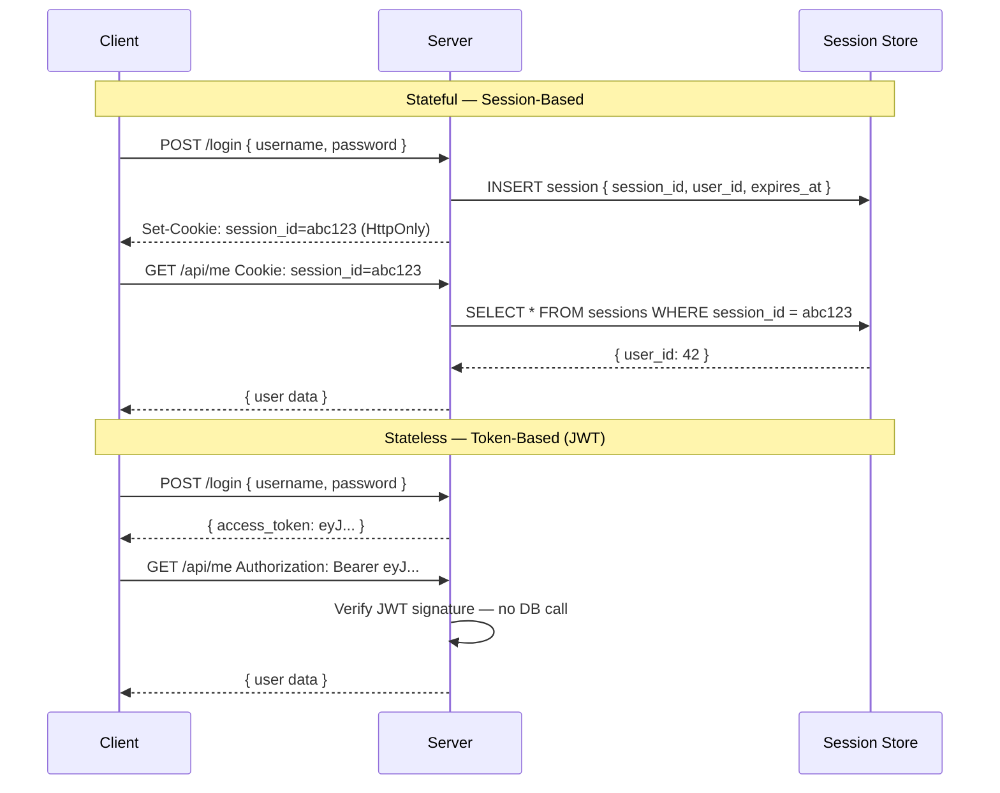
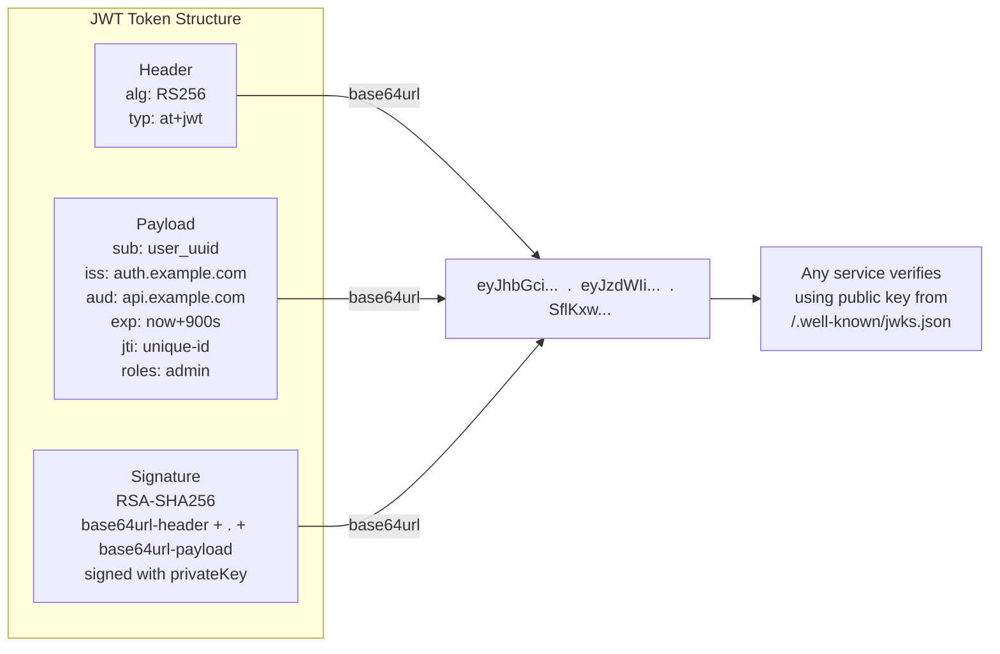

# Lecture 1 — The Foundation: Stateless, Passwords & JWT

## Unit 1 — Section Intro & Cover Image
**type:** prose

## 1. The Foundation — Stateless, Passwords & JWT

The goal of this lecture is not to learn a framework. It is to understand *why* the patterns exist — by building from the simplest possible auth system up to the JWT lifecycle you will encounter in every production backend.

---

## Unit 2 — AuthN vs AuthZ
**type:** prose

### 1.1 AuthN vs AuthZ

**Authentication (AuthN)** — Verifies *who you are*. You prove your identity via password, biometric, OTP, etc.

**Authorization (AuthZ)** — Determines *what you can do*. Once identity is confirmed, the system checks what resources or actions are permitted.

```javascript
AuthN → "Are you Truc?" → Yes (correct password + OTP ✅)
AuthZ → "Can Truc delete users?" → No, Truc is a viewer, not an admin ❌
```

These two concerns are **always separate layers** — even when they appear in the same request. Keep them separate in your code too.

---

## Unit 3 — Stateless vs Stateful
**type:** prose

### 1.2 Stateless vs Stateful

Every auth system makes a fundamental choice: **where does the server store the proof that a user is logged in?**

**Stateful (Session-Based):**
- Server creates a session record and stores it in a database or Redis
- Client receives only a session ID (opaque reference) in a cookie
- Every request: server looks up the session ID → finds the user
- The *server* holds the state — the client is just a key

**Stateless (Token-Based):**
- Server issues a signed token containing user claims
- Client stores the token and sends it on every request
- Every request: server verifies the signature — **no database lookup needed**
- The *token* carries the state — the server is just a verifier

| | Stateful (Session) | Stateless (JWT) |
|---|---|---|
| **State lives** | Server (DB / Redis) | Client (token) |
| **Revocation** | Instant — delete the session | Requires denylist or wait for TTL |
| **Horizontal scaling** | Needs shared session store | Works out of the box |
| **Token size** | Small (session ID only) | Larger (all claims inline) |
| **Best for** | Server-rendered apps, banking | SPAs, microservices, APIs |

> ⚠️ **Neither is universally better.** The right choice depends on your revocation requirements and deployment topology. Most modern systems use a hybrid: stateless access tokens (JWT) + a stateful refresh token record in DB for revocation control.

---

## Unit 4 — Stateless vs Stateful Sequence Diagram
**type:** diagram



---

## Unit 5 — Password Management on the Backend
**type:** prose

### 1.3 Password Management on the Backend

Before tokens, before OAuth — your app needs to store and verify passwords safely.

**The progression (and why each step matters):**

**Step 1 — Plain text ❌ Never do this**
```python
db.store("password", "hunter2")
# One DB breach → every password exposed immediately
```

**Step 2 — SHA-256 ❌ Looks smart, still wrong**
```python
db.store("password_hash", sha256("hunter2"))
# Fast hash → rainbow table attack → cracked in milliseconds
# Same password always produces the same hash → one crack = many accounts
```

**Step 3 — bcrypt ✅ The minimum standard**
```python
db.store("password_hash", bcrypt.hash("hunter2", rounds=12))
# Slow by design — cost factor 12 ≈ 250ms per attempt
# Built-in random salt → same password produces a different hash every time
# At 10 billion guesses/sec: SHA-256 cracks in ~0.1ms, bcrypt takes ~350 years
```

**Production note:** Argon2id (winner of the Password Hashing Competition, 2015) is now preferred over bcrypt — stronger memory-hardness prevents GPU/ASIC attacks. bcrypt is still acceptable and battle-tested.

**The timing attack — always use constant-time comparison:**
```python
# ❌ Leaks timing information — attacker can measure character matches
if password == stored_password:

# ✅ Constant-time — safe
if bcrypt.verify(password, stored_hash):
```

**Three rules to tattoo on your memory:**
1. Never store plaintext passwords — not even temporarily
2. Never use a fast hash (SHA-256, MD5) for passwords — only use a slow, purpose-built one
3. Never compare passwords with `==` — use the library's verify function

---

## Unit 6 — Hashing Playground (Demo)
**type:** demo
**demo_key:** HashingPlayground

Type a password and watch bcrypt vs SHA-256 side by side. Toggle the attack simulation: run 10 billion guesses/sec and watch bcrypt hold while SHA-256 falls instantly. Adjust the bcrypt cost factor and see how it scales the cracking time.

---

## Unit 7 — Quiz: Where Should You Store a JWT Access Token in a SPA?
**type:** quiz

**question:** Where should you store a JWT access token in a Single Page Application (SPA)?
**options:**
- `localStorage` — persists across page refreshes, easy to access
- `sessionStorage` — cleared when the tab closes, slightly safer
- JavaScript memory (a variable or closure) — lost on refresh, requires silent refresh
- An HttpOnly cookie — JS cannot read it at all

**answer:** 2
**explanation:** JavaScript memory is the correct choice for access tokens in SPAs. `localStorage` and `sessionStorage` are both accessible to any JS running on the page — one XSS vulnerability and your token is gone. An HttpOnly cookie is the right place for the *refresh token*, not the short-lived access token. The access token lives in memory and is silently replaced when it expires.
**difficulty:** medium

---

## Unit 8 — Quiz: What Happens When a JWT Is Tampered With?
**type:** quiz

**question:** An attacker intercepts a JWT and changes the `role` claim from `"user"` to `"admin"` in the payload. What happens when the server receives it?
**options:**
- The server accepts it — the payload is just Base64, not encrypted
- The server rejects it — the signature no longer matches the tampered payload
- The server accepts it only if the `alg` header is `"none"`
- It depends on whether the server checks the `exp` claim

**answer:** 1
**explanation:** The signature is computed over the original header + payload. Any change to the payload — even one character — produces a completely different hash. The server recomputes the signature from the received header and payload, compares it to the included signature, and they won't match. *However* — option 2 is also partially true: if the server doesn't whitelist algorithms and an attacker sets `alg: none`, some vulnerable libraries skip verification entirely. This is the `alg:none` attack covered in Unit 17.
**difficulty:** medium

---

## Unit 9 — Quiz: What Should You Never Put in a JWT Payload?
**type:** quiz

**question:** Which of the following is safe to include in a JWT payload?
**options:**
- The user's plaintext password
- The user's credit card number
- The user's role (`"admin"`, `"viewer"`)
- The user's full home address

**answer:** 2
**explanation:** Roles and permission claims are exactly what JWTs are designed to carry — any service that holds the public key can verify the claim without a DB call. The other three are sensitive PII or secrets. **JWT payloads are Base64URL-encoded, not encrypted** — anyone who intercepts the token can read the payload. A JWT is a signed envelope, not a locked safe. Never put passwords, financial data, health records, or government IDs in a JWT payload.
**difficulty:** easy

---

## Unit 10 — JWT: A Standard Independent from OAuth
**type:** prose

### 1.4 JWT — A Separate Standard

> 💡 **JWT and OAuth 2.0 are separate inventions — don't conflate them.**
>
> OAuth 2.0 (RFC 6749) was published in **2012** as an authorization/delegation framework. JWT (RFC 7519) was a completely independent standard published **3 years later in 2015** as a compact token format. OAuth 2.0 does **not** require JWT — you can use plain opaque random strings as tokens inside OAuth. JWT also works entirely without OAuth: as session tokens, API keys, or inter-service credentials. JWT just became the most popular token format *within* OAuth 2.0 ecosystems because it enables stateless, signature-verified claims without a database call.

JWT (RFC 7519, 2015) is a compact, self-contained token format. It carries all the claims a service needs — any server with the public key can verify it **without a database call**.

**Structure:** Three Base64URL-encoded parts separated by dots:

```
eyJhbGciOiJSUzI1NiIsInR5cCI6IkpXVCJ9          ← Header
.eyJzdWIiOiJ1c2VyXzEyMyIsInJvbGVzIjpbImFkbWluIl19  ← Payload
.SflKxwRJSMeKKF2QT4fwpMeJf36POk6yJV_adQssw5c        ← Signature
```

**Header:**
```json
{ "alg": "RS256", "typ": "JWT" }
```

**Payload (claims):**
```json
{
  "sub": "user_uuid_123",
  "iss": "https://auth.example.com",
  "aud": "https://api.example.com",
  "exp": 1700000900,
  "iat": 1700000000,
  "jti": "abc-unique-token-id",
  "roles": ["admin"]
}
```

---

## Unit 11 — JWT Standard Claims Reference
**type:** prose

**Standard claims reference:**

| Claim | Purpose | Recommended value |
|---|---|---|
| **`iss`** | Identifies the auth server | Your canonical auth URL: `"https://auth.example.com"` |
| **`sub`** | Identifies the user | Opaque, immutable UUID — never email or username |
| **`aud`** | Intended recipient(s) | API identifier: `"https://api.example.com"` |
| **`exp`** | Expiration timestamp | `now() + 900` for a 15-minute access token |
| `iat` | Issued-at timestamp | Always set to current time |
| `jti` | Unique token ID | UUIDv4 — enables per-token revocation & replay detection |

**Production rule:** Use RS256 or ES256. Services download the public key from `/.well-known/jwks.json` — no secret sharing needed.

**Never include** in payload: passwords, API keys, credit card numbers, SSNs, health records, or full addresses.

---

## Unit 12 — JWT Decoder (Demo)
**type:** demo
**demo_key:** JWTDecoder

Paste a real JWT and watch it split into header, payload, and signature. Each claim is annotated with its purpose and a green/red badge for safe vs. unsafe content. Includes a "verify with public key" path using a `/.well-known/jwks.json` simulation.

---

## Unit 13 — JWT Structure Diagram
**type:** diagram



**References:**
- [RFC 7519 — JWT](https://datatracker.ietf.org/doc/html/rfc7519)
- [jwt.io — Debugger & Introduction](https://jwt.io/introduction)

---

## Unit 14 — Self-Managed Access + Refresh Token Flow
**type:** prose

### 1.5 Managing Tokens Without OAuth

Before OAuth enters the picture, many applications issue and manage their own tokens. Understanding this flow is foundational — OAuth builds on the same lifecycle.

**The pattern:**

1. User submits credentials (`POST /login`)
2. Server verifies password with `bcrypt.verify`
3. Server mints two tokens:
   - **Access token** — a short-lived JWT (15 min), signed with the server's private key, returned in the response body
   - **Refresh token** — a long-lived opaque random string (7–30 days), stored as a hash in DB, sent as an `HttpOnly` cookie
4. Client stores the access token **in JS memory only** — never in `localStorage`
5. Every API call: `Authorization: Bearer <access_token>`
6. When the access token expires: the refresh cookie is automatically sent → server issues a new AT + new RT (rotation)

**Common mistakes junior engineers make here:**

| Mistake | Risk |
|---|---|
| Storing access token in `localStorage` | One XSS = full account takeover |
| Access token TTL of 24h+ | Stolen token valid for a full day |
| Not rotating the refresh token on use | Stolen refresh token = permanent access |
| Storing refresh token plaintext in DB | DB breach = all refresh tokens compromised |
| Returning refresh token in response body instead of `HttpOnly` cookie | JS can read it — XSS can steal it |

---

## Unit 15 — Self-Managed Token Sequence Diagram
**type:** diagram

```mermaid
sequenceDiagram
    actor User
    participant Client
    participant Server
    participant DB

    User->>Client: Enter username + password
    Client->>Server: POST /login { username, password }
    Server->>DB: SELECT password_hash WHERE username = ?
    DB-->>Server: { password_hash, user_id }
    Server->>Server: bcrypt.verify(password, hash)
    Server->>Server: Sign JWT access_token (15 min, RS256)
    Server->>Server: Generate opaque refresh_token
    Server->>DB: Store hash(refresh_token), user_id, expires_at
    Server-->>Client: { access_token } + Set-Cookie: refresh_token=... HttpOnly; Secure; SameSite=Strict

    Note over Client: Stores access_token in JS memory only

    Client->>Server: GET /api/me  Authorization: Bearer access_token
    Server->>Server: Verify JWT signature + exp + iss + aud
    Server-->>Client: { user data }

    Note over Client,Server: 15 minutes later — access_token expires

    Client->>Server: POST /auth/refresh  (refresh cookie sent automatically by browser)
    Server->>DB: Verify hash(refresh_token), check expires_at
    Server->>DB: Invalidate old refresh_token
    Server->>Server: Issue new access_token + new refresh_token
    Server-->>Client: { new access_token } + Set-Cookie: new refresh_token
```

---

## Unit 16 — JWT Attacks
**type:** prose

### 1.6 JWT Attacks — Key Awareness

| Attack | What happens | Mitigation |
|---|---|---|
| **`alg:none`** | Attacker strips the signature — some libraries accept unsigned token with any payload | Whitelist allowed algorithms server-side; never trust the token's own `alg` header |
| **Algorithm Confusion** | RS256 server gets HS256 token; vulnerable library uses the RSA public key as HMAC secret — forged signature validates | Fix the expected algorithm server-side; never let the token header drive key selection |
| **`kid` Injection** | Attacker manipulates the Key ID header to control which key is loaded (path traversal, SQL injection) | Validate `kid` against a strict allowlist; never interpolate it into file paths or queries |
| **Token Replay** | Stolen valid JWT reused — leaked via logs, browser history, XSS, or network | Short TTLs + `jti` denylist + never put tokens in URLs |

---

## Unit 17 — JWT Forger (Demo)
**type:** demo
**demo_key:** JWTForger

Take a valid JWT, edit any claim (e.g. `role: user` → `role: admin`), and submit it against a sandbox API. Watch the signature verification fail. Toggle `alg: none` to see what happens if the server doesn't whitelist algorithms.

---

## Unit 18 — JWT Validation Checklist
**type:** prose

### 1.7 JWT Validation Checklist

Every incoming request must pass **all** of these checks:

1. ✅ **Structural** — exactly three Base64URL parts separated by periods
2. ✅ **Algorithm** — `alg` header matches server-side whitelist (never trust the header alone)
3. ✅ **Signature** — cryptographic verification using key identified by `kid`
4. ✅ **Expiration** — `exp > now` (allow ≤60 seconds clock skew tolerance)
5. ✅ **Not Before** — `nbf ≤ now` if present
6. ✅ **Issuer** — `iss` matches expected value exactly
7. ✅ **Audience** — `aud` contains this service's identifier
8. ✅ **Subject** — `sub` is present and non-empty
9. ✅ **Type** — `typ` header is `"at+jwt"` for access tokens (prevents cross-JWT confusion attacks)
10. ✅ **Revocation** — `jti` not in denylist (if revocation is implemented)

---

## Unit 19 — Decision Tracer (Demo)
**type:** demo
**demo_key:** DecisionTracer

Send a JWT through the 10-point validation pipeline. Each check lights up green/red; click a step to see the exact code that would run server-side. Pre-loaded scenarios: expired token, wrong audience, missing `jti`, `alg:none`, algorithm confusion.

---
