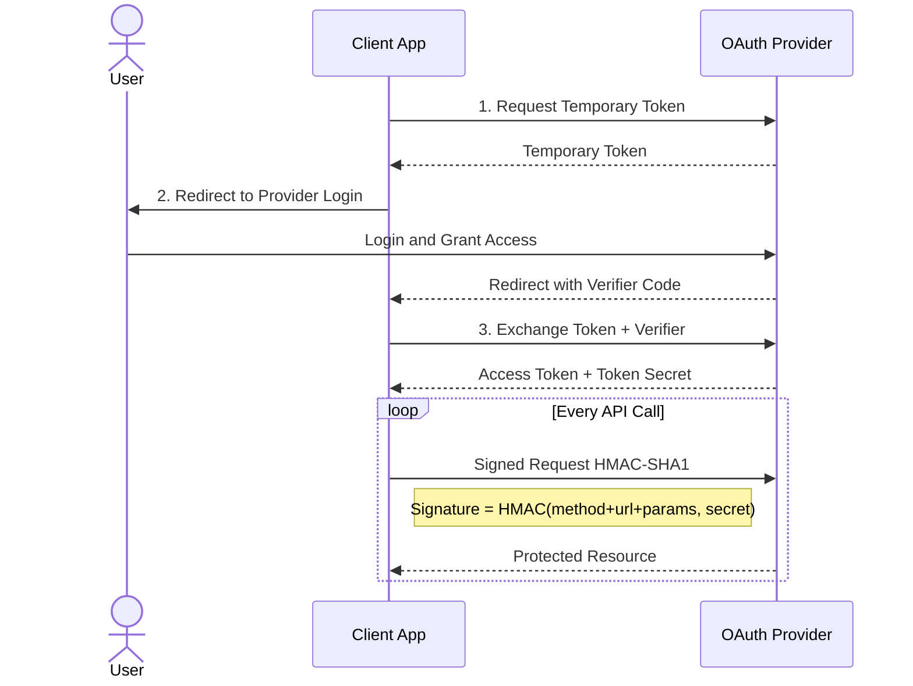
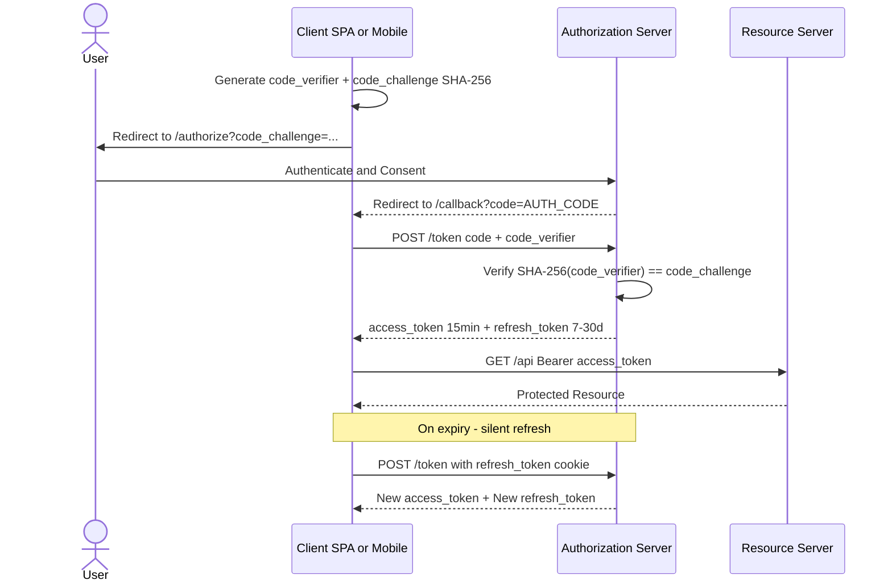
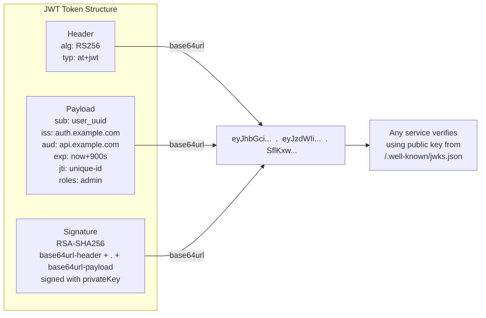

# Lecture 1 — Fundamentals of OAuth & Authentication

## Unit 1 — Section Intro & Cover Image
**type:** prose

## 1. Fundamentals of OAuth & Authentication


---

## Unit 2 — AuthN vs AuthZ
**type:** prose

### 1.1 AuthN vs AuthZ

**Authentication (AuthN)** — Verifies *who you are*. You prove your identity via password, biometric, OTP, etc.

**Authorization (AuthZ)** — Determines *what you can do*. Once identity is confirmed, the system checks what resources or actions are permitted.


```javascript
AuthN → "Are you Truc?" → Yes (correct password + OTP ✅)
AuthZ → "Can Truc delete users?" → No, Truc is a viewer, not an admin ❌
```

---

## Unit 3 — OAuth 1.0: The Password Anti-Pattern
**type:** prose

### 1.2 OAuth 1.0

**🔴 The Problem Before OAuth 1.0 — The Password Anti-Pattern**

Before OAuth existed, the only way a third-party app could act on your behalf was to ask for your **actual username and password**.

**Real-world example:** Twitter's "Find Friends" feature literally asked you to type your Gmail password into Twitter's form. Once you did:

- A Twitter data breach meant **your Gmail password was compromised too**
- Twitter had **unlimited access** — it could read, send, and delete emails freely
- **No revocation** — to cut off Twitter's access you had to change your Gmail password everywhere
- **No scope** — impossible to say "read contacts only," the app got everything

OAuth 1.0 (RFC 5849, 2010) introduced **delegated authorization** — letting third-party apps act on a user's behalf **without ever seeing their password**.

---

## Unit 4 — OAuth 1.0 3-Legged Flow (Demo)
**type:** demo
**demo_key:** OAuthFlowPlayer

**3-Legged Flow:**


1. App requests a temporary **Request Token** from the provider
2. User is redirected to the provider, logs in, and grants access
3. App exchanges the token + verifier for a permanent **Access Token**
4. Every API call is **cryptographically signed** with HMAC-SHA1

Every API call was cryptographically signed: `HMAC-SHA1(method + URL + params, consumer_secret + token_secret)` sent as an `Authorization: OAuth ...` header. Exact parameter ordering was required — one wrong encoding broke the signature entirely.

---

## Unit 5 — OAuth 1.0 Sequence Diagram
**type:** diagram



**References:**
- [RFC 5849 — OAuth 1.0a](https://datatracker.ietf.org/doc/html/rfc5849)

---

## Unit 6 — OAuth 2.0: Why OAuth 1.0 Was Replaced
**type:** prose

### 1.3 OAuth 2.0

**🔴 The Problems with OAuth 1.0 (that led to OAuth 2.0)**

> ⚠️ **Why it was replaced:** Signature computation was complex and error-prone. Parameter order mattered exactly. No mobile-friendly flows. Libraries implemented it inconsistently.

OAuth 1.0 solved the password anti-pattern but created its own set of pain points:

- **Signature complexity** — Every request required computing HMAC-SHA1 over exact parameter ordering. One wrong encoding or missing parameter broke the signature. Libraries implemented it inconsistently, causing constant interoperability failures.
- **Mobile-unfriendly** — The 3-legged flow required browser redirects. Native mobile apps had no clean way to receive the OAuth callback.
- **Token secret on the client** — The `token_secret` had to be stored client-side, replacing the password problem with a different secret management problem.
- **No scopes** — OAuth 1.0 was all-or-nothing. You couldn't express "read contacts only" — apps got full access or none.

OAuth 2.0 (RFC 6749, 2012) dropped signatures entirely, relying on **HTTPS for transport security**. It introduced multiple **grant types** for different use cases instead of one-size-fits-all.

---

## Unit 7 — OAuth 2.0 Grant Types Overview
**type:** prose

**Grant Types at a glance:**

| Grant Type | Use Case | Key Characteristic |
|---|---|---|
| **Authorization Code + PKCE** | Web apps, SPAs, mobile | Redirect flow + code exchange; PKCE prevents interception |
| **Client Credentials** | Backend service-to-service (M2M) | No user involved; app authenticates with `client_id` + `client_secret` |
| **Device Code** | Smart TVs, CLIs | Device shows code → user authorizes on phone → device polls for token |

---

## Unit 8 — Client ID vs. Client Secret
**type:** prose

**🔑 Client ID vs. Client Secret — What Are They For?**

Every app registered with an OAuth authorization server gets two identifiers:

- **`client_id`** — A **public** identifier for your app, like a username. Safe to include in URLs, frontend code, and mobile app bundles. The auth server uses it to look up your registered redirect URIs and display your app name on the user consent screen ("App X wants access to your account").
- **`client_secret`** — A **private password** for your app. Proves the app really is who it claims to be during the token exchange. **Must never appear in frontend JavaScript, mobile app binaries, or public source code** — anyone can decompile an APK or read browser DevTools.

|  | **client_id** | **client_secret** |
|---|---|---|
| **Visibility** | Public — safe in URLs and frontend JS | Private — server-side only, never in client code |
| **Purpose** | Identifies *which app* is requesting access | Authenticates *that the app is legitimate* |
| **Used in auth redirect** | ✅ Always (`?client_id=...`) | ❌ Never in the URL redirect |
| **Used in token exchange** | ✅ Required | ✅ Confidential clients (backends) only |
| **Public clients (SPA/mobile)** | ✅ Used | ❌ Cannot store securely → use PKCE instead |

---

## Unit 9 — PKCE & Authorization Code Interception Attack
**type:** prose

**🔐 Why PKCE? — The Authorization Code Interception Attack**

The Authorization Code flow was originally designed for **confidential clients** (backends that can safely store `client_secret`). But SPAs and mobile apps are **public clients** — their code runs in the user's hands. A `client_secret` bundled in an app binary can be extracted by anyone.


> ⚠️ **The attack (on mobile, without PKCE):**
> 1. Your app registers `myapp://callback` as its redirect URI
> 2. A *malicious app* also registers `myapp://callback` — custom URL schemes are not exclusive on Android/iOS
> 3. User logs in via browser → Google redirects with `?code=AUTH_CODE`
> 4. The OS asks which app handles `myapp://` — the malicious app wins
> 5. Malicious app has the auth code — and since public clients often skip `client_secret`, it exchanges `code` for tokens
> 6. **Result: attacker owns the user's session**

**PKCE (Proof Key for Code Exchange, RFC 7636)** binds the token exchange to the exact device that started the flow using a one-time cryptographic proof.

**Why it works:** The `code_verifier` never travels over the network until the legitimate exchange. Even if an attacker captures the `AUTH_CODE`, they cannot complete the exchange without the verifier that only the real client generated. No shared secret needed — PKCE works for all public clients.

---

## Unit 10 — PKCE Simulator
**type:** demo
**demo_key:** PKCESimulator

Interactive simulator: generate a `code_verifier`, derive its SHA-256 `code_challenge`, and watch the authorization server bind the code exchange to the originating client. Toggle "attacker intercepts" to see PKCE block the attack.

---

## Unit 11 — Behind the Scenes: How the Auth Server Manages Clients
**type:** code

**🏭 Behind the Scenes: How the Auth Server Manages Clients**

**Step 1 — Registration (when the developer creates an app in the console):**

```python
# Auth server generates the pair
client_id     = base64url(secureRandom(16 bytes))   # public identifier
client_secret = base64url(secureRandom(32 bytes))   # private password

# Hash the secret BEFORE storing — same principle as password hashing
client_secret_hash = bcrypt(client_secret, cost=12)

db.insert("oauth_clients", {
    client_id:          client_id,          # stored plaintext — it's public
    client_secret_hash: client_secret_hash, # NEVER store plaintext secret
    redirect_uris:      ["https://app.com/callback"],
    allowed_grants:     ["authorization_code", "refresh_token"],
    is_confidential:    True,
    is_active:          True,
})

# Secret is shown ONCE to the developer — never retrievable again
return { client_id, client_secret }
```

**Step 2 — Storage Schema:**

```sql
CREATE TABLE oauth_clients (
    client_id           VARCHAR(128) PRIMARY KEY,  -- public, stored plaintext
    client_secret_hash  VARCHAR(255),              -- bcrypt/Argon2 hash only
    redirect_uris       TEXT[],                    -- exact match enforced
    allowed_grants      TEXT[],                    -- authorization_code, client_credentials...
    allowed_scopes      TEXT[],
    is_confidential     BOOLEAN,                   -- false = public client, no secret check
    is_active           BOOLEAN
);
```

**Step 3 — Verification at `/token` (every token exchange):**

```python
def exchange_code_for_token(request):
    # 1. Parse client_id + client_secret from Basic Auth header or request body
    client_id, provided_secret = parse_client_credentials(request)

    # 2. Fast lookup by client_id (plaintext, indexed)
    client = db.get("SELECT * FROM oauth_clients WHERE client_id = ?", client_id)
    if not client:
        raise Unauthorized("unknown_client")

    # 3. Verify secret via bcrypt — NOT a == comparison
    if client.is_confidential:
        if not bcrypt.verify(provided_secret, client.client_secret_hash):
            raise Unauthorized("invalid_client")  # vague — don't reveal WHY

    # 4. Redirect URI must exactly match a registered value — no wildcards
    if request.redirect_uri not in client.redirect_uris:
        raise InvalidRequest("redirect_uri_mismatch")

    # 5. Look up and validate the one-time auth code
    auth_code = db.get("SELECT * FROM auth_codes WHERE code = ?", request.code)
    if not auth_code or auth_code.client_id != client_id:
        raise InvalidGrant("code_invalid_or_stolen")
    if auth_code.expires_at < now():
        raise InvalidGrant("code_expired")

    # 6. Immediately invalidate — auth codes are single-use
    db.delete(auth_code)

    # 7. Issue access + refresh tokens
    return issue_tokens(client, auth_code.user_id, auth_code.scope)
```

> 💡 **Why `bcrypt.verify` and not `==`?** The server stores only the hash, never the plaintext secret. You re-hash the incoming value with bcrypt and compare — same reason you can't "look up" a user's password.
>
> **Why a vague error message?** `invalid_client` never reveals whether the `client_id` is unknown or the `client_secret` is wrong. This prevents attackers from enumerating which client IDs exist.
>
> **Why immediately delete the auth code?** Auth codes are one-time-use. If the same code is presented twice, it means the first exchange was potentially stolen — some servers revoke the issued tokens too.

---

## Unit 12 — Authorization Code + PKCE Full Flow (Demo)
**type:** demo
**demo_key:** OAuthFlowPlayer

**Authorization Code + PKCE — Full Flow:**


**Client Credentials (M2M) — Java/Micronaut:**

```java
HttpRequest<?> request = HttpRequest.POST(tokenUrl, Map.of(
    "grant_type", "client_credentials",
    "client_id", clientId,
    "client_secret", clientSecret,
    "scope", "api.read"
)).contentType(MediaType.APPLICATION_FORM_URLENCODED);
TokenResponse token = client.toBlocking().retrieve(request, TokenResponse.class);
```

---

## Unit 13 — Authorization Code + PKCE Sequence Diagram
**type:** diagram



**References:**
- [RFC 6749 — OAuth 2.0](https://datatracker.ietf.org/doc/html/rfc6749)
- [RFC 7636 — PKCE](https://datatracker.ietf.org/doc/html/rfc7636)
- [OAuth 2.0 Playground — Google](https://developers.google.com/oauthplayground)

---

## Unit 14 — JWT: Separate from OAuth
**type:** prose

### 1.4 JWT (JSON Web Tokens)

> 💡 **JWT and OAuth 2.0 are separate inventions — don't confuse them.**
>
> OAuth 2.0 (RFC 6749) was published in **2012** as an authorization/delegation framework. JWT (RFC 7519) was a completely independent standard published **3 years later in 2015** as a compact token format. OAuth 2.0 does **not** require JWT — you can use plain opaque random strings as tokens with OAuth. JWT just became the most popular token format *within* OAuth 2.0 ecosystems because it enables stateless, signature-verified claims without a database call. JWT also works entirely without OAuth (e.g. as session tokens, API keys, or inter-service credentials in non-OAuth systems).

JWT (RFC 7519, 2015) is the standard compact token format used inside OAuth 2.0. It carries all the claims a service needs — any server with the public key can verify it **without a database call**.

**Structure:** Three Base64URL-encoded parts separated by dots:

```javascript
eyJhbGciOiJSUzI1NiIsInR5cCI6IkpXVCJ9          ← Header
.eyJzdWIiOiJ1c2VyXzEyMyIsInJvbGVzIjpbImFkbWluIl19  ← Payload
.SflKxwRJSMeKKF2QT4fwpMeJf36POk6yJV_adQssw5c        ← Signature
```

**Header:**

```json
{ "alg": "RS256", "typ": "JWT" }
```

**Payload (claims):**

```json
{
  "sub": "user_uuid_123",
  "iss": "https://auth.example.com",
  "aud": "https://api.example.com",
  "exp": 1700000900,
  "iat": 1700000000,
  "jti": "abc-unique-token-id",
  "roles": ["admin"]
}
```

---

## Unit 15 — JWT Standard Claims Reference
**type:** prose

**Standard claims reference:**

| Claim | Purpose | Recommended value |
|---|---|---|
| **`iss`** | Identifies the auth server | Your canonical auth URL: `"https://auth.example.com"` |
| **`sub`** | Identifies the user | Opaque, immutable UUID — never email or username |
| **`aud`** | Intended recipient(s) | API identifier: `"https://api.example.com"` |
| **`exp`** | Expiration timestamp | `now() + 900` for a 15-minute access token |
| `iat` | Issued-at timestamp | Always set to current time |
| `jti` | Unique token ID | UUIDv4 — enables per-token revocation & replay detection |

**Production rule:** Use RS256/ES256. Services download the public key from `/.well-known/jwks.json` — no secret sharing needed.

**Never include** in payload: passwords, API keys, credit card numbers, SSNs, health records, or full addresses.

---

## Unit 16 — JWT Decoder (Demo)
**type:** demo
**demo_key:** JWTDecoder

Paste a JWT and watch it split into header, payload, signature. Each claim is annotated with its purpose and a green/red badge for safe vs unsafe content. Includes a "verify with public key" path using `/.well-known/jwks.json` simulation.

---

## Unit 17 — JWT Structure Diagram
**type:** diagram



**References:**
- [RFC 7519 — JWT](https://datatracker.ietf.org/doc/html/rfc7519)
- [jwt.io — Debugger & Introduction](https://jwt.io/introduction)

---

## Unit 18 — Multi-Factor Authentication (MFA)
**type:** prose

### 1.5 Multi-Factor Authentication (MFA)

> 💡 **MFA is an Authentication (AuthN) concern — it operates on a completely different layer from OAuth 2.0.**
>
> OAuth 2.0 is an **authorization** framework — it governs *who can access what* and lets apps act on a user's behalf. MFA is an **authentication** mechanism — it strengthens *proving who you are*. The two are orthogonal: when you "Login with Google" via OAuth, Google may challenge you with an MFA code — but that happens inside Google's AuthN layer, not as part of the OAuth protocol. You can have OAuth without MFA, MFA without OAuth, or both layered together. Think of it as: MFA guards the gate, OAuth decides what's behind the gate.

MFA requires **two or more** of:

- **Something you know** — password, PIN
- **Something you have** — authenticator app, hardware key, phone OTP
- **Something you are** — fingerprint, Face ID (biometrics)

**TOTP (RFC 6238)** — 6-digit code valid for 30 seconds, derived from `HMAC(shared_secret, floor(time / 30))`. Used by Google Authenticator, Authy.

**WebAuthn / Passkeys (FIDO2)** — device-bound private key; server stores only the public key. Phishing-resistant by design. The modern gold standard — no shared secret to steal.

**SMS OTP** — weakest second factor; vulnerable to SIM-swapping. Acceptable for consumer apps, avoid for high-security systems.


---
