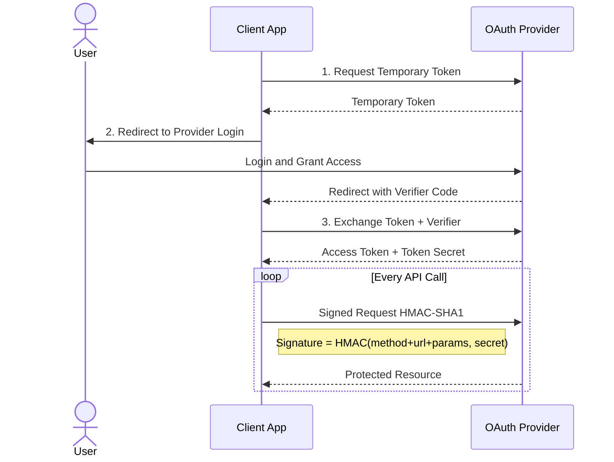
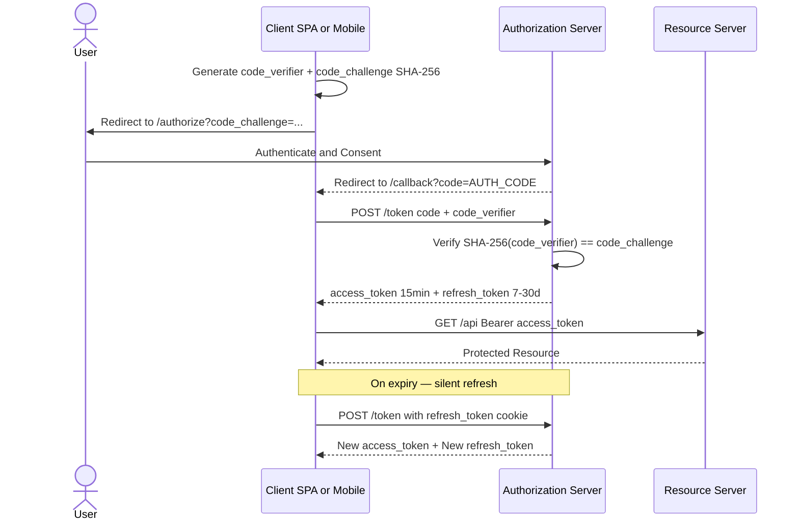

# Lecture 2 — OAuth: Delegated Authorization

## Unit 1 — Section Intro & Cover Image
**type:** prose

## 2. OAuth — Delegated Authorization

In Lecture 1 we built auth ourselves: hash passwords, mint JWTs, rotate refresh tokens. That works — until a third-party app needs to act on a user's behalf. This lecture explains why that boundary forced the creation of OAuth, how OAuth 2.0 works, and the token lifecycle best practices that go with it.

---

## Unit 2 — Why OAuth? The Problem with Self-Managed Auth
**type:** prose

### 2.1 Why OAuth?

Self-managed auth is fine when *your* app talks to *your* API. It breaks down the moment a third party needs delegated access.

**The scenario:**
> A user wants to let a travel-planning app read their Google Calendar to find free slots. How does the travel app get access?

**Before OAuth — The Password Anti-Pattern:**
The only option was to give the travel app your Google username and password. Once you did:

- A breach at the travel app meant **your Google password was exposed**
- The app had **unlimited access** — it could read email, delete events, access Drive
- **No revocation** — to cut off the app you had to change your Google password everywhere
- **No scope** — impossible to say "read calendar only"; the app got everything

OAuth solves this by separating *who grants access* (the user + Google) from *who uses the access* (the travel app) — without the travel app ever seeing your Google password.

> 💡 **Self-managed JWT auth (Lecture 1) and OAuth answer different questions.**
>
> - Self-managed: "How does my app authenticate its own users?"
> - OAuth: "How does an external app act on a user's behalf without seeing their credentials?"

---

## Unit 3 — OAuth 1.0: The Password Anti-Pattern Era
**type:** prose

### 2.2 OAuth 1.0

OAuth 1.0 (RFC 5849, 2010) introduced **delegated authorization** — letting third-party apps act on a user's behalf **without ever seeing their password**.

**3-Legged Flow:**

1. App requests a temporary **Request Token** from the provider
2. User is redirected to the provider, logs in, and grants access
3. App exchanges the token + verifier for a permanent **Access Token**
4. Every API call is **cryptographically signed** with HMAC-SHA1

Every API call was cryptographically signed: `HMAC-SHA1(method + URL + params, consumer_secret + token_secret)` sent as an `Authorization: OAuth ...` header. Exact parameter ordering was required — one wrong encoding broke the signature entirely.

---

## Unit 4 — OAuth 1.0 3-Legged Flow (Demo)
**type:** demo
**demo_key:** OAuthFlowPlayer

Interactive step-through of the OAuth 1.0 3-legged flow: request token → user redirect → access token exchange → signed API calls.

---

## Unit 5 — OAuth 1.0 Sequence Diagram
**type:** diagram



**References:**
- [RFC 5849 — OAuth 1.0a](https://datatracker.ietf.org/doc/html/rfc5849)

---

## Unit 6 — OAuth 2.0: Why OAuth 1.0 Was Replaced
**type:** prose

### 2.3 OAuth 2.0

**🔴 The Problems with OAuth 1.0 (that led to OAuth 2.0)**

> ⚠️ **Why it was replaced:** Signature computation was complex and error-prone. Parameter order mattered exactly. No mobile-friendly flows. Libraries implemented it inconsistently.

- **Signature complexity** — Every request required computing HMAC-SHA1 over exact parameter ordering. One wrong encoding or missing parameter broke the signature.
- **Mobile-unfriendly** — The 3-legged flow required browser redirects. Native mobile apps had no clean way to receive the OAuth callback.
- **Token secret on the client** — The `token_secret` had to be stored client-side, replacing the password problem with a different secret management problem.
- **No scopes** — OAuth 1.0 was all-or-nothing. You couldn't express "read contacts only."

OAuth 2.0 (RFC 6749, 2012) dropped signatures entirely, relying on **HTTPS for transport security**. It introduced multiple **grant types** for different use cases instead of one-size-fits-all.

---

## Unit 7 — OAuth 2.0 Grant Types Overview
**type:** prose

**Grant Types at a glance:**

| Grant Type | Use Case | Key Characteristic |
|---|---|---|
| **Authorization Code + PKCE** | Web apps, SPAs, mobile | Redirect flow + code exchange; PKCE prevents interception |
| **Client Credentials** | Backend service-to-service (M2M) | No user involved; app authenticates with `client_id` + `client_secret` |
| **Device Code** | Smart TVs, CLIs | Device shows code → user authorizes on phone → device polls for token |

---

## Unit 8 — Client ID vs. Client Secret
**type:** prose

### 2.4 Client ID vs. Client Secret

Every app registered with an OAuth authorization server gets two identifiers:

- **`client_id`** — A **public** identifier for your app. Safe to include in URLs, frontend code, and mobile app bundles. The auth server uses it to look up your registered redirect URIs and display your app name on the consent screen.
- **`client_secret`** — A **private password** for your app. Proves the app really is who it claims to be during the token exchange. **Must never appear in frontend JavaScript, mobile app binaries, or public source code.**

|  | **client_id** | **client_secret** |
|---|---|---|
| **Visibility** | Public — safe in URLs and frontend JS | Private — server-side only, never in client code |
| **Purpose** | Identifies *which app* is requesting access | Authenticates *that the app is legitimate* |
| **Used in auth redirect** | ✅ Always (`?client_id=...`) | ❌ Never in the URL redirect |
| **Used in token exchange** | ✅ Required | ✅ Confidential clients (backends) only |
| **Public clients (SPA/mobile)** | ✅ Used | ❌ Cannot store securely → use PKCE instead |

---

## Unit 9 — PKCE & Authorization Code Interception Attack
**type:** prose

### 2.5 PKCE — Proof Key for Code Exchange

The Authorization Code flow was originally designed for **confidential clients** (backends that can safely store `client_secret`). But SPAs and mobile apps are **public clients** — their code runs in the user's hands.

> ⚠️ **The attack (on mobile, without PKCE):**
> 1. Your app registers `myapp://callback` as its redirect URI
> 2. A *malicious app* also registers `myapp://callback` — custom URL schemes are not exclusive on Android/iOS
> 3. User logs in via browser → Google redirects with `?code=AUTH_CODE`
> 4. The OS asks which app handles `myapp://` — the malicious app wins
> 5. Malicious app has the auth code — and since public clients often skip `client_secret`, it exchanges `code` for tokens
> 6. **Result: attacker owns the user's session**

**PKCE (RFC 7636)** binds the token exchange to the exact device that started the flow using a one-time cryptographic proof.

**Why it works:** The `code_verifier` never travels over the network until the legitimate exchange. Even if an attacker captures the `AUTH_CODE`, they cannot complete the exchange without the verifier that only the real client generated. No shared secret needed — PKCE works for all public clients.

---

## Unit 10 — PKCE Simulator (Demo)
**type:** demo
**demo_key:** PKCESimulator

Interactive simulator: generate a `code_verifier`, derive its SHA-256 `code_challenge`, and watch the authorization server bind the code exchange to the originating client. Toggle "attacker intercepts" to see PKCE block the attack.

---

## Unit 11 — Behind the Scenes: How the Auth Server Manages Clients
**type:** code

**Step 1 — Registration (when the developer creates an app in the console):**

```python
client_id     = base64url(secureRandom(16 bytes))
client_secret = base64url(secureRandom(32 bytes))

client_secret_hash = bcrypt(client_secret, cost=12)

db.insert("oauth_clients", {
    client_id:          client_id,
    client_secret_hash: client_secret_hash,
    redirect_uris:      ["https://app.com/callback"],
    allowed_grants:     ["authorization_code", "refresh_token"],
    is_confidential:    True,
    is_active:          True,
})

return { client_id, client_secret }  # Secret shown ONCE — never retrievable again
```

**Step 2 — Storage Schema:**

```sql
CREATE TABLE oauth_clients (
    client_id           VARCHAR(128) PRIMARY KEY,
    client_secret_hash  VARCHAR(255),              -- bcrypt/Argon2 hash only
    redirect_uris       TEXT[],                    -- exact match enforced
    allowed_grants      TEXT[],
    allowed_scopes      TEXT[],
    is_confidential     BOOLEAN,
    is_active           BOOLEAN
);
```

**Step 3 — Verification at `/token`:**

```python
def exchange_code_for_token(request):
    client_id, provided_secret = parse_client_credentials(request)
    client = db.get("SELECT * FROM oauth_clients WHERE client_id = ?", client_id)
    if not client:
        raise Unauthorized("unknown_client")

    if client.is_confidential:
        if not bcrypt.verify(provided_secret, client.client_secret_hash):
            raise Unauthorized("invalid_client")  # vague — don't reveal why

    if request.redirect_uri not in client.redirect_uris:
        raise InvalidRequest("redirect_uri_mismatch")

    auth_code = db.get("SELECT * FROM auth_codes WHERE code = ?", request.code)
    if not auth_code or auth_code.client_id != client_id:
        raise InvalidGrant("code_invalid_or_stolen")
    if auth_code.expires_at < now():
        raise InvalidGrant("code_expired")

    db.delete(auth_code)  # Auth codes are single-use — delete immediately

    return issue_tokens(client, auth_code.user_id, auth_code.scope)
```

> 💡 **Why `bcrypt.verify` and not `==`?** The server stores only the hash, never the plaintext secret.
>
> **Why a vague error message?** `invalid_client` never reveals whether the `client_id` is unknown or the `client_secret` is wrong — prevents attacker enumeration.
>
> **Why immediately delete the auth code?** Auth codes are one-time-use. If the same code is presented twice, the first exchange was potentially stolen — some servers revoke the issued tokens too.

---

## Unit 12 — Authorization Code + PKCE Full Flow (Demo)
**type:** demo
**demo_key:** OAuthFlowPlayer

Interactive step-through of the full Authorization Code + PKCE flow, from generating the `code_verifier` to receiving the access token. Includes the Client Credentials (M2M) flow as a second mode.

**Client Credentials (M2M) — Java/Micronaut:**
```java
HttpRequest<?> request = HttpRequest.POST(tokenUrl, Map.of(
    "grant_type", "client_credentials",
    "client_id", clientId,
    "client_secret", clientSecret,
    "scope", "api.read"
)).contentType(MediaType.APPLICATION_FORM_URLENCODED);
TokenResponse token = client.toBlocking().retrieve(request, TokenResponse.class);
```

---

## Unit 13 — Authorization Code + PKCE Sequence Diagram
**type:** diagram



**References:**
- [RFC 6749 — OAuth 2.0](https://datatracker.ietf.org/doc/html/rfc6749)
- [RFC 7636 — PKCE](https://datatracker.ietf.org/doc/html/rfc7636)
- [OAuth 2.0 Playground — Google](https://developers.google.com/oauthplayground)

---

## Unit 14 — Token Lifetime
**type:** prose

### 2.6 Token Lifetime

| Token | Recommended TTL | Notes |
|---|---|---|
| **Access token** | 5–15 minutes | 5 min for banking/healthcare; 15 min for general web apps |
| **Refresh token** | 7–30 days | Always rotate on every use; 7–14 days with rotation is the consensus |
| **ID token (OIDC)** | Same as access token | For identity only — never use as API bearer token |

---

## Unit 15 — Refresh Token Rotation & Reuse Detection
**type:** prose

### 2.7 Refresh Token Rotation & Reuse Detection

Every time a refresh token is used, issue a **new one and immediately invalidate the old**. If a previously-used token is presented → the entire token family is revoked.

```javascript
Login          → issues AT₁ + RT₁
AT₁ expires   → client sends RT₁ → server issues AT₂ + RT₂, invalidates RT₁
Attacker uses stolen RT₁ → server detects reuse → revokes entire family
Both user and attacker must re-authenticate
```

Two FE implementation strategies: **401 handler** (catch expired responses and refresh) or **silent refresh** (proactively refresh at ~75% of the access token's lifetime before expiry).

> 💡 Short-lived access tokens paired with long-lived refresh tokens form the standard JWT lifecycle. The access token is stateless and fast to validate; the refresh token is stateful and enables revocation.

---

## Unit 16 — Token Storage Deep Dive
**type:** prose

### 2.8 Token Storage — Deep Dive

**The recommended defense-in-depth pattern:**

- Store the **access token in JavaScript memory only**. Protected from CSRF because it must be explicitly attached via `Authorization` header. Lost on page refresh — client silently fetches a new one via the refresh cookie.
- Store the **refresh token in an `HttpOnly; Secure; SameSite=Strict` cookie**. JavaScript cannot read it, neutralizing XSS-based theft.

**Full comparison:**

| Storage | XSS Risk | CSRF Risk | Survives Refresh | Verdict |
|---|---|---|---|---|
| **`localStorage`** | ❌ High | ✅ Safe | ✅ Yes | ❌ Never use for tokens |
| **`sessionStorage`** | ❌ High | ✅ Safe | ❌ No | ❌ No security advantage over localStorage |
| **JS Memory** | ✅ Safe | ✅ Safe | ❌ No | ✅ Best for access tokens in SPAs |
| **HttpOnly Cookie** | ✅ Safe | ⚠️ Needs SameSite + CSRF token | ✅ Yes | ✅ Best for refresh tokens |

> ⚠️ **`sessionStorage` is NOT safer than `localStorage` for tokens.** Both are accessible by any JavaScript running on the page.

**Cookie attributes that matter:**
```
Set-Cookie: refresh_token=eyJ...
  HttpOnly        ← JS cannot read — blocks XSS token theft
  Secure          ← HTTPS only
  SameSite=Strict ← blocks CSRF
  Path=/auth      ← scoped to auth endpoints only
  Max-Age=604800  ← 7 days
```

---

## Unit 17 — Revocation Strategies
**type:** prose

### 2.9 Revocation Strategies

The core tension: **JWTs are stateless by design, but real apps need to revoke access immediately** — on logout, password change, or account compromise.

**Strategy 1 — Short TTL (pseudo-revocation)**
With 5–15 min access tokens, revoking only the refresh token limits the exposure window. Maintains pure statelessness but accepts a brief vulnerability window. Acceptable for most apps.

**Strategy 2 — Redis Denylist (production standard)**
Store revoked `jti` values in Redis with TTL = token's remaining lifetime — Redis auto-expires them, no cleanup needed. Overhead: ~1–2ms per request. For "log out everywhere": store a `revoked_at` timestamp per user and reject any token whose `iat` is earlier than that timestamp.

**Strategy 3 — Token Versioning**
Store a `jwt_version` integer per user in DB. Embed it as a `ver` claim in every JWT. On a security event, increment the version — all previous tokens instantly invalid. Tradeoff: requires a DB/cache lookup per request.

**Always trigger revocation on:**
- Password change or reset
- Account compromise detected
- Admin deactivation
- MFA enrollment changes
- Role or permission changes
- Explicit "log out everywhere"

> ⚠️ Client-side token deletion alone is **not** revocation. A stolen token can still be used even after the client deletes it locally.

---

## Unit 18 — Key Management & Rotation
**type:** prose

### 2.10 Key Management & Rotation

Rotate signing keys every **90 days** (NIST). Three phases:

1. **Announce** — generate new keypair, publish to JWKS, keep signing with old key
2. **Activate** — switch to signing with new key, keep old public key in JWKS for still-valid tokens
3. **Retire** — remove old key once all tokens it signed have expired

Always store private keys in a KMS (AWS KMS, HashiCorp Vault) — never in source code or environment variables committed to git.

---

## Unit 19 — Security Checklist
**type:** prose

### 2.11 Security Checklist

- ✅ Use PKCE for all Authorization Code flows (all public clients)
- ✅ Use RS256 or ES256 over HS256 in multi-service environments
- ✅ Enable refresh token rotation with reuse detection
- ✅ Store access token in JS memory; refresh token in HttpOnly cookie
- ✅ Never use `localStorage` or `sessionStorage` for tokens
- ✅ Set `HttpOnly; Secure; SameSite=Strict` on all auth cookies
- ✅ Never put sensitive data in JWT payload (Base64 is not encryption)
- ✅ Rotate signing keys every 90 days via JWKS
- ✅ Maintain Redis denylist for immediate revocation on logout or compromise
- ✅ Never send JWTs in URL query parameters

---

## Unit 20 — Micronaut Config
**type:** code

```yaml
micronaut:
  security:
    authentication: bearer
    token:
      jwt:
        signatures:
          secret:
            generator:
              secret: "${JWT_GENERATOR_SIGNATURE_SECRET}"
              jws-algorithm: HS256
        claims-validators:
          expiration: true
          subject-not-null: true
          issuer: "https://auth.example.com"
          audience: "https://api.example.com"
        generator:
          refresh-token:
            secret: "${JWT_GENERATOR_SIGNATURE_SECRET}"
      generator:
        access-token:
          expiration: 900  # 15 minutes
```

---

## Unit 21 — Myth-Buster: "Login with Google" Is Not OAuth
**type:** prose

### 2.12 Wait — What Is "Login with Google" Then?

> ❌ **Common belief:** "Login with Google" uses OAuth 2.0
> ✅ **Reality:** It uses **OpenID Connect (OIDC)** — a thin identity layer built *on top of* OAuth 2.0

This is one of the most widespread misconceptions in the industry. Here's the precise distinction:

| | OAuth 2.0 | OpenID Connect (OIDC) |
|---|---|---|
| **Question it answers** | "Can this app access your Google Drive?" | "Who are you?" |
| **Purpose** | Authorization — delegate resource access | Authentication — assert user identity |
| **Returns** | Access token (opaque, for resource access) | Access token **+ ID token** (a JWT with identity claims) |
| **Standard** | RFC 6749 (2012) | Built on OAuth 2.0 (2014) |

**OAuth 2.0 alone:**
```
"App X is allowed to read your Google Calendar"
→ Server gets an access_token to call the Calendar API
→ Server does NOT know who you are — only that access was granted
```

**OIDC:**
```
"You are truc@gmail.com"
→ Server gets an access_token (for API access) + an id_token (your identity)
→ id_token is a JWT: { sub: "google|12345", email: "truc@gmail.com", name: "Truc Le" }
```

**The key addition OIDC makes:**

```
GET /.well-known/openid-configuration
→ Returns discovery document: token endpoint, userinfo endpoint, JWKS URI, scopes supported

POST /token
→ Returns: { access_token, id_token, refresh_token }

GET /userinfo (with access_token)
→ Returns: { sub, email, name, picture, ... }
```

> 💡 **Rule of thumb:**
> - Need to *access a resource* on behalf of a user? → OAuth 2.0
> - Need to know *who the user is*? → OIDC (which uses OAuth 2.0 underneath)
> - "Login with X" is always OIDC — never bare OAuth 2.0

We cover OIDC in depth in **Lecture 3**.

---

## Unit 22 — References
**type:** prose

**References:**

- [RFC 6749 — OAuth 2.0](https://datatracker.ietf.org/doc/html/rfc6749)
- [RFC 7636 — PKCE](https://datatracker.ietf.org/doc/html/rfc7636)
- [RFC 8725 — JWT Best Current Practices](https://datatracker.ietf.org/doc/html/rfc8725)
- [OWASP JWT Cheat Sheet](https://cheatsheetseries.owasp.org/cheatsheets/JSON_Web_Token_for_Java_Cheat_Sheet.html)
- [Auth0 — Refresh Token Rotation](https://auth0.com/docs/secure/tokens/refresh-tokens/refresh-token-rotation)
- [FusionAuth — Revoking JWTs](https://fusionauth.io/articles/tokens/revoking-jwts)
- [NIST SP 800-63B](https://pages.nist.gov/800-63-3/sp800-63b.html)
- [Scott Brady — Which JWT Signing Algorithm Should I Use?](https://www.scottbrady.io/jose/jwts-which-signing-algorithm-should-i-use)

---
