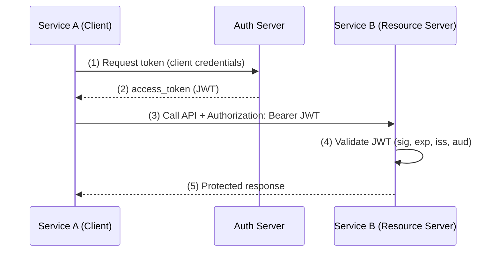
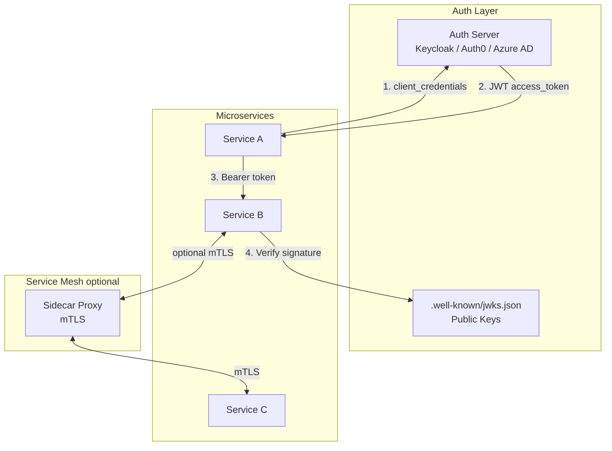

# Lecture 3 — Service-to-Service Authentication

## Unit 1 — Goal
**type:** prose

## 3. Service-to-Service Authentication

> 🔐 **Goal:** When Service A calls Service B, Service B must be able to verify **who** is calling and **what** that caller is allowed to do — even when there is **no user session**.

---

## Unit 2 — The Problem: "Who is the caller?"
**type:** prose

### 3.1 The problem: "Who is the caller?"

In microservices, traffic is often:

- Internal (east-west) traffic over private networks
- High volume + automated
- Not tied to a human user session

**Threat model:** if Service B trusts "anything inside the VPC/cluster," then any compromised pod/service (or misconfigured workload) can call privileged endpoints.

> ⚠️ **Anti-pattern:** "Internal API = trusted API."
> Private network boundaries are not an authentication mechanism.

**What we want instead:** strong, verifiable identity for services + enforceable authorization.

---

## Unit 3 — Baseline Architecture
**type:** prose

### 3.2 Baseline architecture: Auth Server issues access tokens

**Participants**

- **Service A (Client)**: the caller
- **Auth Server (AS)**: verifies credentials, issues tokens
- **Service B (Resource Server / RS)**: validates token and serves protected resources

**High-level flow:**

1. Service A authenticates to the Auth Server
2. Auth Server issues an access token (often JWT)
3. Service A calls Service B with `Authorization: Bearer <access_token>`
4. Service B validates the token and applies authorization rules

---

## Unit 4 — Baseline Architecture Diagram
**type:** diagram



---

## Unit 5 — OAuth 2.0 Client Credentials Grant
**type:** prose

### 3.3 OAuth 2.0 Client Credentials (most common for M2M)

**When to use:** no end user, purely service-to-service (batch jobs, internal APIs, cron workers).

**Inputs:** `client_id` + `client_secret` (or private key, depending on setup).

> 📨 Example token request (form-encoded)
>
> ```
> POST /oauth/token
> Content-Type: application/x-www-form-urlencoded
>
> grant_type=client_credentials&client_id=...&client_secret=...&scope=orders.read
> ```

**What the Auth Server checks before issuing a token (typical):**

- client exists + active
- secret (or credential) is valid
- requested scopes are allowed
- optional: audience / allowed APIs / IP allowlist

---

## Unit 6 — JWT Claims for M2M
**type:** prose

### 3.4 What the token should contain (JWT claims that matter)

JWT is popular because Service B can validate it locally (stateless), but you must encode the right information.

**Common claims for M2M:**

- `sub`: the calling service identity (e.g., `service-a`)
- `iss`: your Auth Server
- `aud`: the API/service that should accept this token (e.g., `service-b`)
- `exp`: short expiry (5–15 minutes)
- `scope` or `scp`: allowed permissions

> 🧾 **Rule of thumb:** put *authorization hints* (scopes/roles) in the token, but never put secrets or PII.

---

## Unit 7 — Validation and Authorization
**type:** prose

### 3.5 How Service B validates and authorizes requests

**Validation (authn for services):**

- verify signature using JWKS/public key
- verify `exp` (and optionally `nbf`)
- verify `iss` and `aud`
- optionally: verify `typ` (e.g., `at+jwt`)

**Authorization:**

- map `scope` → allowed endpoints/actions
- enforce least privilege per route

**Mini example: mapping scope to API**

- `orders.read` → `GET /orders/*`
- `orders.write` → `POST /orders`, `PATCH /orders/*`

---

## Unit 8 — Alternatives: mTLS, Service Mesh, API Keys
**type:** prose

### 3.6 Alternatives & when to consider them

- **mTLS (mutual TLS)**: strong identity at transport layer; great for zero-trust / service mesh
- **Service mesh identity (Istio/Linkerd)**: can automate cert rotation + policy enforcement
- **API keys**: simplest, but weaker governance (rotation, scoping, audit) unless you build a lot around it
- **JWT assertion / private_key_jwt**: avoid shared secrets; better for high-security clients

---

## Unit 9 — mTLS Visualizer (Demo)
**type:** demo
**demo_key:** MTLSVisualizer

Watch Service A and Service B exchange certificates during the TLS handshake. Each side validates the other's cert against a trusted CA. Toggle "expired cert" or "wrong CN" to see the handshake fail before any application data is exchanged.

---

## Unit 10 — Best Practices & Architecture Diagram
**type:** diagram

### 3.7 Best practices checklist

- Short-lived access tokens (5–15 min)
- Always validate `iss`, `aud`, signature, and expiry
- Store secrets in a secret manager (Vault/KMS), never in code
- Rotate credentials and signing keys
- Prefer per-service identity (no shared clients across many services)
- Log token identifiers safely (avoid logging full tokens)

> 🧭 **Good mental model:** OAuth 2.0 tells you *how to obtain a token*; JWT tells you *what the token looks like*; Service B's policy tells you *what the caller can do*.



---
