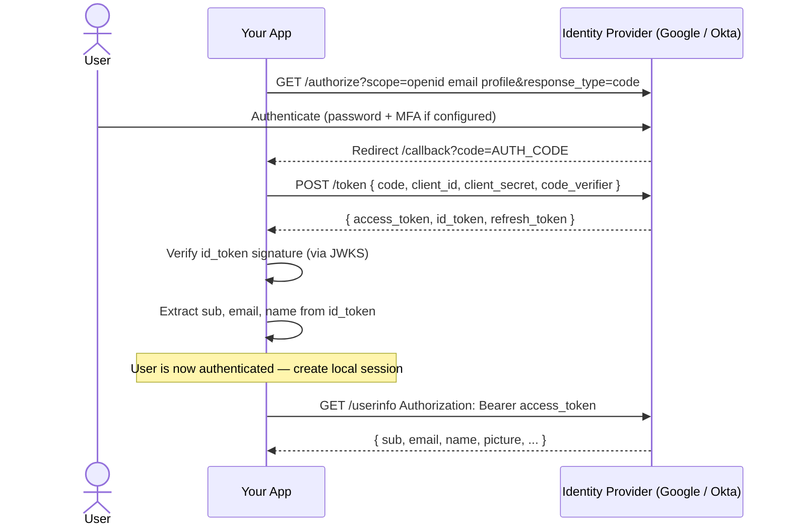
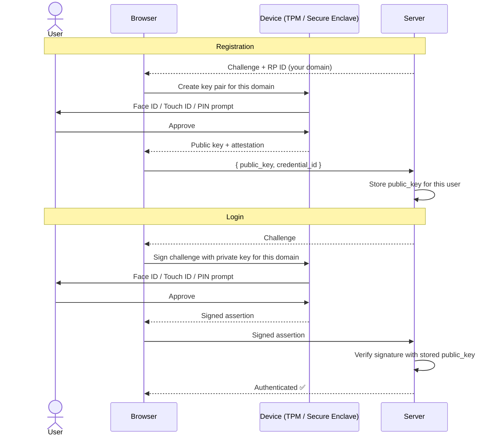

# Lecture 3 — Sessions, MFA & Modern AuthN

## Unit 1 — Section Intro
**type:** prose

## 3. Sessions, MFA & Modern AuthN

Lecture 2 ended with a cliffhanger: "Login with Google" is OIDC, not bare OAuth 2.0. This lecture explains why — by covering the identity layer (OIDC), the session layer (how you stay logged in after authentication), and the factors that prove who you are (MFA). Each topic is covered at a practical depth. Use the **Learn More** links to go deeper.

---

## ── Block A: Sessions ──────────────────────────────────────

## Unit 2 — Cookie-Based Sessions (Stateful)
**type:** prose

### 3.1 Cookie-Based Sessions

**What it is:** The server stores a session record; the client holds only a session ID cookie that points to it.

**How it works:**
1. User logs in → server creates a session record in DB or Redis
2. Server returns `Set-Cookie: session_id=abc123` (HttpOnly, Secure)
3. Browser automatically sends the cookie on every subsequent request
4. Server looks up `session_id` → retrieves the user's context
5. Logout → server deletes the session record → cookie becomes useless

**When to use it:**
- Server-rendered applications (Next.js SSR, Rails, Django)
- Banking and healthcare — where instant revocation is required
- Anywhere you can't tolerate even a 15-minute token validity window after logout

**Trade-off:** Doesn't scale horizontally without a shared session store (Redis, Memcached). If you have 3 servers, every server must be able to reach the same session store or requests will fail on round-robin.

**Learn More →**
- [OWASP Session Management Cheat Sheet](https://cheatsheetseries.owasp.org/cheatsheets/Session_Management_Cheat_Sheet.html)
- [MDN — HTTP Cookies](https://developer.mozilla.org/en-US/docs/Web/HTTP/Cookies)

---

## Unit 3 — Session Attacks
**type:** prose

### 3.2 Session Attacks

Two attacks to know — both are fixable with one line of code each.

**Session Fixation:**
Attacker plants a known session ID *before* the user logs in. If the server keeps the same session ID after login, the attacker's pre-planted cookie now points to an authenticated session.

```
Fix: Always regenerate the session ID immediately on login.
session.regenerate()  // one call in any framework
```

**Session Hijacking:**
Attacker steals a valid session cookie (via XSS, network sniff, or log leak) and replays it as their own.

```
Fix: HttpOnly + Secure + SameSite=Strict on the cookie.
Optionally: bind the session to the client's IP or User-Agent (tradeoff: breaks mobile networks).
```

> ⚠️ Session hijacking is why `HttpOnly` matters. If JS can read the cookie, XSS can steal the session.

**Learn More →**
- [OWASP Session Hijacking Attack](https://owasp.org/www-community/attacks/Session_hijacking_attack)
- [OWASP Session Fixation](https://owasp.org/www-community/attacks/Session_fixation)

---

## ── Block B: OIDC ─────────────────────────────────────────

## Unit 4 — OpenID Connect (OIDC)
**type:** prose

### 3.3 OpenID Connect (OIDC)

**What it is:** A thin identity layer built on top of OAuth 2.0. It standardizes how a server asserts *who the user is* — the piece OAuth 2.0 deliberately left out.

**What it adds to OAuth 2.0:**

| OAuth 2.0 alone | OIDC adds |
|---|---|
| Access token (for resource access) | **ID token** — a JWT with identity claims |
| No standard for user identity | `/userinfo` endpoint — fetch the user's profile |
| No discovery | `/.well-known/openid-configuration` — auto-discover endpoints |

**The three endpoints that matter:**

```
GET /.well-known/openid-configuration
→ Discovery document: where are the token, userinfo, and JWKS endpoints?

POST /token
→ Returns: { access_token, id_token, refresh_token }

GET /userinfo  (Authorization: Bearer access_token)
→ Returns: { sub, email, name, picture, email_verified, ... }
```

**What's in the ID token:**
```json
{
  "iss": "https://accounts.google.com",
  "sub": "104261234567890",
  "email": "truc@gmail.com",
  "name": "Truc Le",
  "aud": "your-client-id.apps.googleusercontent.com",
  "exp": 1700000900,
  "iat": 1700000000
}
```

**The rule:** Use the ID token to establish *who the user is*. Use the access token to *call APIs*. Never use the ID token as a bearer token for API calls.

**Learn More →**
- [OpenID Connect Core 1.0 Spec](https://openid.net/specs/openid-connect-core-1_0.html)
- [Auth0 — What is OpenID Connect?](https://auth0.com/docs/authenticate/protocols/openid-connect-protocol)
- [Google Identity — OpenID Connect](https://developers.google.com/identity/openid-connect/openid-connect)

---

## Unit 5 — OIDC Flow Diagram
**type:** diagram



---

## ── Block C: MFA ──────────────────────────────────────────

## Unit 6 — MFA Overview
**type:** prose

### 3.4 Multi-Factor Authentication (MFA)

**What it is:** Requiring a user to prove identity using two or more independent factors.

**The three factor categories:**

| Factor | What it is | Examples |
|---|---|---|
| **Something you know** | A secret only you hold | Password, PIN |
| **Something you have** | A physical device or token | Authenticator app, hardware key, phone |
| **Something you are** | A biological trait | Fingerprint, Face ID |

MFA = any **two** of these three categories. Two passwords is not MFA — they're both "something you know."

> 💡 **MFA is an AuthN concern — it operates on a completely separate layer from OAuth 2.0.** When you "Login with Google" via OIDC, Google may challenge you with an MFA code — but that happens inside Google's AuthN layer, not as part of the OAuth or OIDC protocol.

---

## Unit 7 — TOTP (Authenticator Apps)
**type:** prose

### 3.5 TOTP — Time-Based One-Time Password

**What it is:** A 6-digit code that changes every 30 seconds, generated by an app on your phone (Google Authenticator, Authy, 1Password).

**How it works:**
1. Setup: server generates a shared secret → encodes it as a QR code → user scans into their app
2. At login: both the server and the app independently compute `HMAC(shared_secret, floor(time / 30))`
3. They arrive at the same 6-digit number without any network communication
4. Code is valid for one 30-second window (server often allows ±1 window for clock drift)

**Why it works without internet:** The shared secret is seeded once at setup. After that, the math is deterministic — both sides produce the same number from the same inputs (secret + time).

**Weakness:** The shared secret lives on the server. If the server is breached, all TOTP secrets are exposed — attackers can generate valid codes for any user.

**Use when:** Strong second factor for consumer apps, internal tools, and enterprise systems.

**Learn More →**
- [RFC 6238 — TOTP](https://datatracker.ietf.org/doc/html/rfc6238)
- [How TOTP Works — a visual walkthrough](https://totp.danhersam.com/)

---

## Unit 8 — SMS OTP
**type:** prose

### 3.6 SMS OTP

**What it is:** A one-time code sent to your phone number via SMS.

**How it works:** Server generates a random 6-digit code → sends via SMS → user enters it → server verifies and expires it.

**Why it's popular:** Low friction — no app to install, works on any phone, widely understood by non-technical users.

**The weakness — SIM swapping:**
An attacker calls your carrier, impersonates you, and transfers your phone number to their SIM. From that point, all SMS messages (including OTP codes) go to the attacker.

**Verdict:**
- ✅ Acceptable for consumer apps where UX friction matters
- ❌ Avoid for high-security systems, admin access, or financial transactions
- NIST SP 800-63B (2024 revision) no longer recommends SMS OTP as a primary second factor for Authenticator Assurance Level 2

**Learn More →**
- [NIST SP 800-63B — Digital Identity Guidelines](https://pages.nist.gov/800-63-3/sp800-63b.html)
- [Wired — The SIM Swap Hack That Changed Twitter Forever](https://www.wired.com/story/sim-swap-hack-jack-dorsey-twitter/)

---

## Unit 9 — Passkeys & WebAuthn
**type:** prose

### 3.7 Passkeys / WebAuthn — The Modern Standard

**What it is:** Your device holds a private key. The server stores only the corresponding public key. Login = device signs a server-issued challenge with the private key.

**How it works:**
1. **Registration:** device generates a key pair → public key stored on server → private key stays on device (never leaves)
2. **Login:** server sends a random challenge → device signs it with private key → server verifies with stored public key
3. **Biometric gate:** before signing, device may require Face ID, fingerprint, or PIN to unlock the private key

**Why it's better than TOTP or SMS:**

| | TOTP | SMS | Passkeys |
|---|---|---|---|
| **Phishing resistant** | ❌ Code can be entered on fake site | ❌ | ✅ Key is bound to the exact domain |
| **Server secret to steal** | ❌ Shared secret | N/A | ✅ Server holds only public key |
| **Works without network** | ✅ | ❌ | ✅ |
| **UX** | OK | Easy | Excellent (biometric) |

**Browser support:** Chrome, Safari, Edge, Firefox — plus iOS and Android native support since 2023.

**The direction the industry is moving:** Google, Apple, GitHub, and Microsoft have all deployed passkeys for primary authentication. No password needed at all.

**Learn More →**
- [passkeys.dev — Official Guide](https://passkeys.dev/)
- [web.dev — Passkeys](https://web.dev/passkey-registration/)
- [FIDO2 / WebAuthn Spec](https://www.w3.org/TR/webauthn-2/)

---

## Unit 10 — WebAuthn Registration & Login Diagram
**type:** diagram



---

## ── Block D: SSO ──────────────────────────────────────────

## Unit 11 — Single Sign-On (SSO)
**type:** prose

### 3.8 Single Sign-On (SSO)

**What it is:** Log in once to an Identity Provider (IdP) → access multiple apps without re-authenticating.

**How it works:**
1. User visits App A → App A redirects to the IdP (e.g. Okta, Google Workspace, Azure AD)
2. IdP authenticates the user (with MFA if configured)
3. IdP issues an ID token / SAML assertion → App A trusts it
4. User visits App B → App B redirects to the same IdP → IdP sees an active session → issues token without prompting again

**When to use it:** Any company running multiple internal tools — one login for Jira, Slack, GitHub, your own apps. Users never manage per-app passwords; IT controls access centrally.

**Trade-off:** The IdP becomes a single point of failure. If the IdP goes down, all SSO-protected apps become inaccessible.

**Learn More →**
- [Okta — What is SSO?](https://www.okta.com/blog/2021/02/single-sign-on/)
- [Auth0 — SSO Implementation](https://auth0.com/docs/authenticate/single-sign-on)

---

## Unit 12 — SAML vs OIDC
**type:** prose

### 3.9 SAML vs OIDC — Which SSO Protocol?

Two protocols that enable SSO. You'll encounter both — SAML in enterprise, OIDC in modern apps.

| | SAML 2.0 | OIDC |
|---|---|---|
| **Year** | 2005 | 2014 |
| **Format** | XML assertions | JSON / JWT |
| **Transport** | Browser POST (form) | HTTP redirect + JSON API |
| **Mobile friendly** | ❌ | ✅ |
| **Developer experience** | Complex XML, certificate management | Simple, libraries everywhere |
| **Enterprise adoption** | Very high — Salesforce, Workday | Growing rapidly |
| **Use when** | Legacy enterprise vendor requires it | New systems, anything modern |

**Rule of thumb:** If the vendor only supports SAML (common in enterprise SaaS), use SAML. For anything you control, use OIDC.

**Learn More →**
- [Okta — SAML vs OIDC](https://www.okta.com/identity-101/saml-vs-oauth/)
- [Auth0 — SAML](https://auth0.com/docs/authenticate/protocols/saml)

---

## Unit 13 — References
**type:** prose

**References:**

- [OpenID Connect Core 1.0](https://openid.net/specs/openid-connect-core-1_0.html)
- [RFC 6238 — TOTP](https://datatracker.ietf.org/doc/html/rfc6238)
- [W3C WebAuthn Level 2](https://www.w3.org/TR/webauthn-2/)
- [FIDO2 Overview — FIDO Alliance](https://fidoalliance.org/fido2/)
- [NIST SP 800-63B — Digital Identity Guidelines](https://pages.nist.gov/800-63-3/sp800-63b.html)
- [OWASP Session Management Cheat Sheet](https://cheatsheetseries.owasp.org/cheatsheets/Session_Management_Cheat_Sheet.html)
- [passkeys.dev](https://passkeys.dev/)

---
