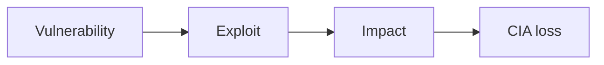

# Lecture 4 — Security Fundamentals

## Unit 1 — Goal
**type:** prose

## 4. Security Fundamentals

> 🛡️ **Goal:** Reduce risk by protecting the **CIA triad** (Confidentiality, Integrity, Availability) across data, services, and users.

---

## Unit 2 — Why Security Matters & CIA Triad
**type:** prose

### 4.1 Why security matters (real impact)

In modern systems (APIs + microservices + third-party integrations), a single weakness can cascade.

**CIA triad — quick mapping**

- **Confidentiality:** prevent data leakage (PII, tokens, secrets)
- **Integrity:** prevent unauthorized changes (balances, permissions, orders)
- **Availability:** keep systems usable (DDoS, resource exhaustion)

> 🎯 **Rule:** Security is not "extra features" — it's correctness under adversarial input.

---

## Unit 3 — Vulnerability → Exploit → Impact Diagram
**type:** diagram



---

## Unit 4 — Hashing vs Encryption
**type:** prose

### 4.2 Hashing vs. encryption (don't mix them)

> 🔑 **Hashing = one-way** (verify) • **Encryption = two-way** (protect + recover)

#### Hashing (one-way) — for passwords

- Purpose: store something you can **verify** but never need to recover
- Use: **bcrypt** / **Argon2** (slow by design → resists brute force)
- Always add a unique **salt** (good libs do this)

```text
password → hash(password + salt) → store hash
login → hash(input + same salt) → compare
```

> ⚠️ Never use MD5/SHA-1/SHA-256 "plain hashing" for passwords. They are too fast → attackers can crack at scale.

#### Encryption (two-way) — for sensitive data

- Purpose: store/transmit data that must be **recovered** later
- Typical: **AES-256-GCM** (confidentiality + integrity)
- Keys must live in **KMS/Vault**, not in code/config

```text
plaintext → encrypt(key) → ciphertext
ciphertext → decrypt(key) → plaintext
```

**Common examples**

- Encrypt: PII fields, API tokens at rest, secrets in DB
- Hash: passwords, (sometimes) refresh token hashes

---

## Unit 5 — Hashing Playground (Demo)
**type:** demo
**demo_key:** HashingPlayground

Type a password and compare its representation under MD5, SHA-256, bcrypt, and Argon2 side-by-side. Watch the bcrypt cost factor change crack time from "1 second" to "centuries." Includes a salt visualization showing why two identical passwords produce different hashes.

---

## Unit 6 — Top Vulnerabilities (OWASP Mindset)
**type:** prose

### 4.3 Top vulnerabilities you must recognize (OWASP mindset)

> 📌 **Pattern:** Most attacks are just "untrusted input reaches a sensitive sink."

---

## Unit 7 — SQL Injection
**type:** prose

#### 4.3.1 SQL Injection

**How it happens:** user input is concatenated into SQL.

```sql
-- Vulnerable idea (do NOT do this)
SELECT * FROM users WHERE email = '" + input + "'
```

**Fix checklist:**

- Parameterized queries / prepared statements
- Strict validation on identifiers (table/column names)
- Principle of least privilege for DB users (read vs write)

---

## Unit 8 — XSS (Cross-Site Scripting)
**type:** prose

#### 4.3.2 XSS (Cross-Site Scripting)

**What it is:** attacker-controlled JS runs in the victim's browser.

**Typical impact:** steal tokens, perform actions as user.

**Fix checklist:**

- Output encoding/escaping (server and client)
- Content Security Policy (CSP)
- Avoid storing tokens in `localStorage`

---

## Unit 9 — Broken Access Control
**type:** prose

#### 4.3.3 Broken Access Control

**What it is:** users can access resources they shouldn't (IDOR, missing checks).

**Fix checklist:**

- Enforce authorization **server-side** on every request
- Never trust roles/claims sent from client
- Test with "change `id` in URL" scenarios

---

## Unit 10 — OWASP Attack Simulator (Demo)
**type:** demo
**demo_key:** OWASPAttackSimulator

A sandbox API with three vulnerable endpoints (SQLi, reflected XSS, IDOR). Toggle "fixed version" to see the same payload neutralized by parameterized queries, output encoding, and server-side authorization checks.

---

## Unit 11 — Core Security Principles
**type:** prose

### 4.4 Core security principles (engineering habits)

**1) Never trust client input**

- Validate types, ranges, formats
- Treat every string as potentially malicious

**2) Least privilege**

- Minimal scopes/roles per service, per endpoint
- Separate credentials for read/write paths

**3) Defense in depth**

- Multiple layers: authn + authz + validation + logging + rate limiting

**4) Secure secret management**

- No secrets in code
- Rotation + audit logs
- Use KMS/Vault + short-lived credentials where possible

---

## Unit 12 — "In Our System" Mapping & Key Takeaway
**type:** prose

### 4.5 "In our system" mapping (example)

- Passwords: hashed (bcrypt/Argon2)
- Auth: JWT validated on the API
- Transport: HTTPS everywhere
- Authorization: enforced on backend routes

> ✅ **Outcome:** Only authenticated identities with the right permissions can access protected resources.

### 4.6 Key takeaway

Security = **correctness under attack**:

- Strong authentication
- Consistent authorization
- Safe data handling (hash vs encrypt)
- Secure defaults + layered defenses

---
