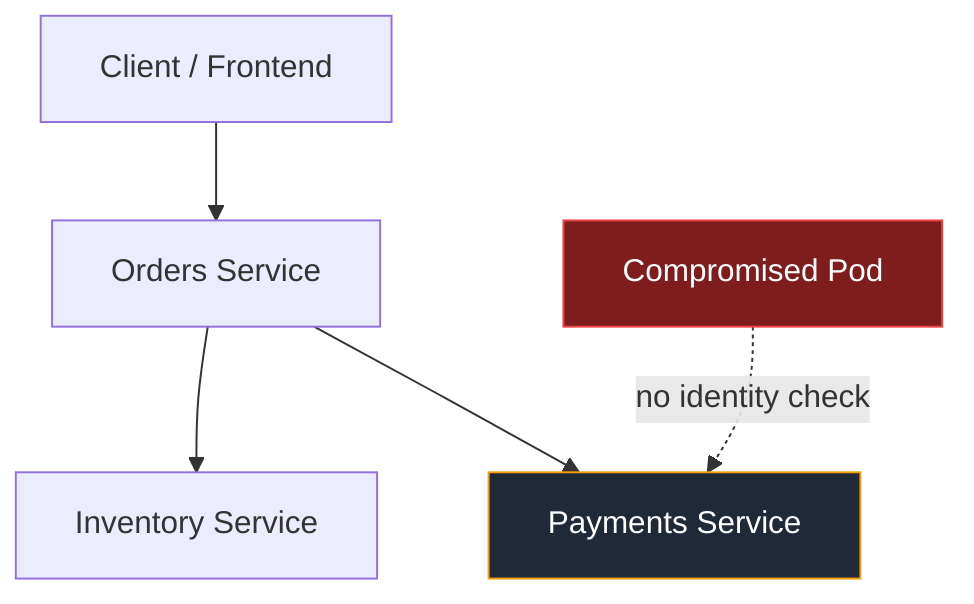
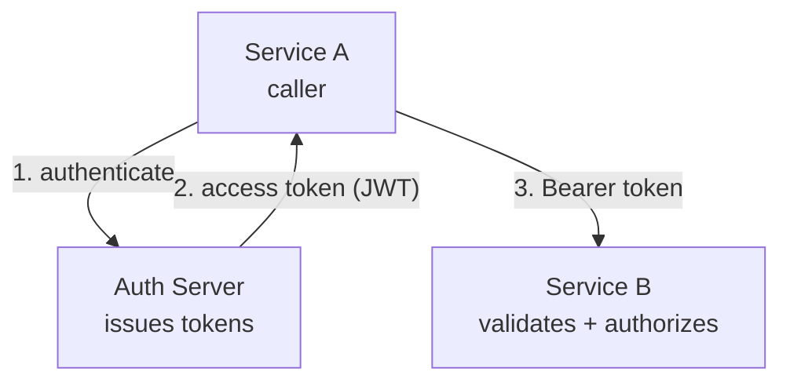
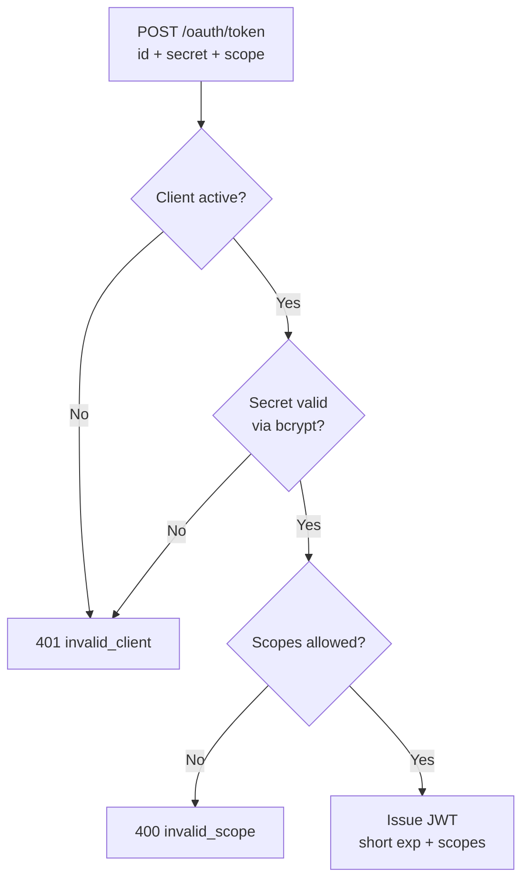
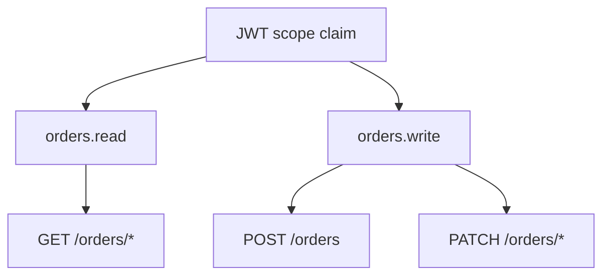
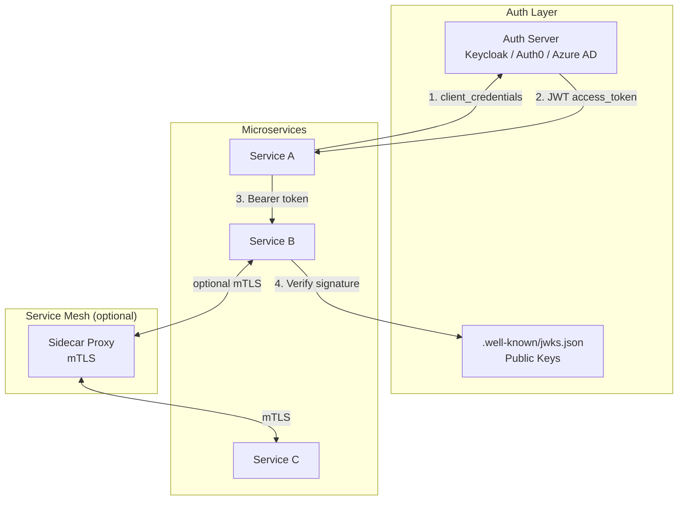

# Lecture 4 — Service-to-Service Authentication

> Structure follows source §3.1–3.7, condensed to **10 steps**. Each `##` block maps
> 1:1 to a unit in `src/content/lectures/service-to-service.ts`. Speaker talk-track
> lives in `lecture-4-service-to-service-speaker-notes.md`.
>
> Most prose steps are paired with their diagram in a **two-column** unit (text left,
> diagram right) so a topic and its picture share one step. Every unit sets a `section`
> kicker (e.g. "§ 3.3 · Client Credentials") rendered as a small per-step header.

## Step 1 — 3.1 The Problem: Who Is the Caller?
**type:** two-column (prose + diagram) · **section:** § 3.1 · The Problem

**Left (prose):** Goal callout, east-west / automated / sessionless traits, threat model, "what we want", anti-pattern warn callout.

**Right (diagram) — east-west threat:**

---

## Step 2 — 3.2 Baseline Architecture
**type:** two-column (prose + diagram) · **section:** § 3.2 · Baseline Architecture

**Left (prose):** Auth Server in the middle; participants (A / AS / B); 4-step flow; "Service B validates locally."

**Right (diagram) — participants:**

---

## Step 3 — 3.3 Client Credentials: How a Service Logs In as Itself
**type:** two-column (prose + diagram) · **section:** § 3.3 · Client Credentials

**Left (prose):** "Logs in as itself" analogy (id/secret = app's username+password), the 4-step exchange, form-encoded token request, "credentials in, scoped token out", + callout on why exchange the secret for a token.

**Right (diagram) — AS decision flow:**

---

## Step 4 — 3.4 JWT Claims for M2M
**type:** prose · **section:** § 3.4 · JWT Claims

Claims that matter (`sub`, `iss`, `aud`, `exp`, `scope`/`scp`) + rule-of-thumb callout (authorization hints yes, secrets/PII no — Base64 is encoding, not encryption).

---

## Step 5 — Decode an M2M Token (Demo)
**type:** demo · **section:** § 3.4 · JWT Claims · **demo_key:** JWTDecoder

Decode a sample M2M token; inspect `sub`/`aud`/`exp`/`scope`; tamper to break the signature.

---

## Step 6 — 3.5 Validation & Authorization
**type:** two-column (prose + diagram) · **section:** § 3.5 · Validation & Authorization

**Left (prose):** Validation ("is this token real and meant for me?") vs Authorization ("is this caller allowed?") — both must pass.

**Right (diagram) — scope → API:**

---

## Step 7 — Trace Service B's Decision (Demo)
**type:** demo · **section:** § 3.5 · JWT Validation · **demo_key:** DecisionTracer

Toggle each validation check and watch Service B accept/reject. First failure wins.

---

## Step 8 — 3.6 Alternatives
**type:** prose · **section:** § 3.6 · Alternatives

mTLS / service mesh / API keys / `private_key_jwt`, plus the mental model: OAuth = how to obtain a token; JWT = what it looks like; Service B's policy = what the caller can do.

---

## Step 9 — mTLS Handshake (Demo)
**type:** demo · **section:** § 3.6 · Alternatives · **demo_key:** MTLSVisualizer

Watch the certificate exchange; toggle "expired cert" / "wrong CN" to see the handshake fail before any application data.

---

## Step 10 — 3.7 Best Practices: Putting It All Together
**type:** two-column (prose + diagram) · **section:** § 3.7 · Best Practices

**Left (prose):** the operational checklist (short-lived tokens, validate iss/aud/sig/exp, secrets in Vault/KMS, rotate, per-service identity, log token IDs only).

**Right (diagram) — M2M architecture:**

---
