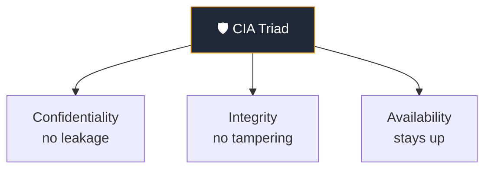
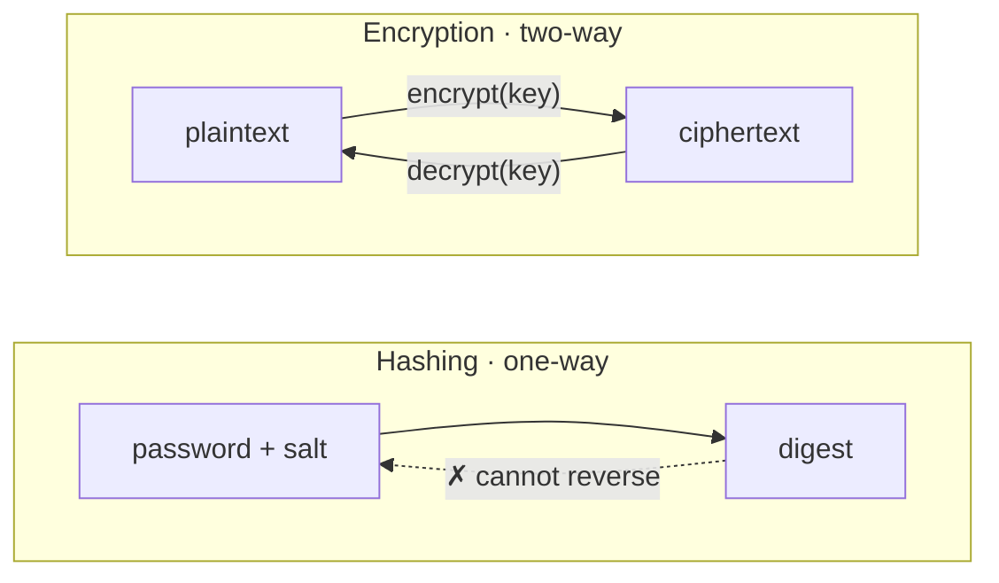
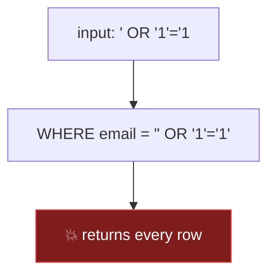
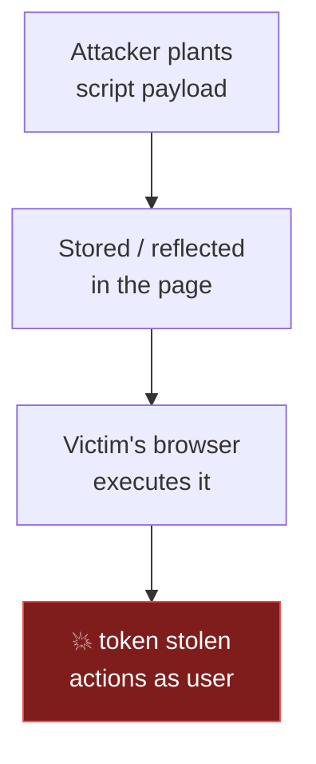
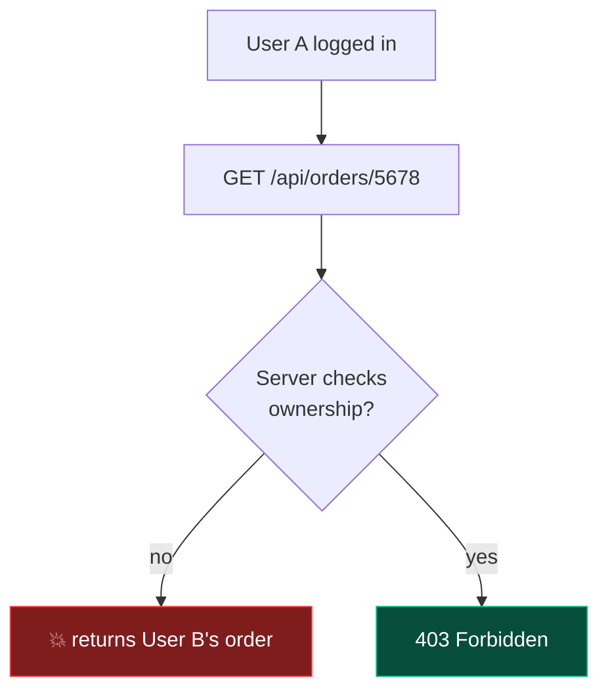
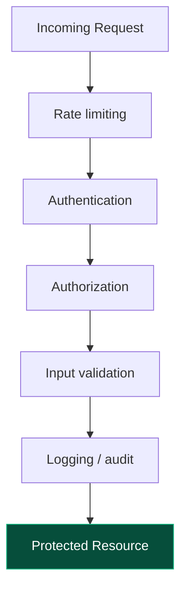

# Lecture 5 — Security Fundamentals

> Structure follows source §4.1–4.5, condensed to **8 steps**. Each `##` block maps
> 1:1 to a unit in `src/content/lectures/security-fundamentals.ts`. Most concept steps
> are **two-column** units (prose left, diagram right) with a `section` kicker
> (e.g. "§ 4.3.1 · SQL Injection").
>
> **Demos:** trimmed to a single "hero" demo (XSS Sandbox) for the live 45-minute slot.
> HashingPlayground and SQLiSandbox were removed from the deck.

## Step 1 — 4.1 Why Security Matters: Protect the CIA Triad
**type:** two-column (prose + diagram) · **section:** § 4.1 · Why Security Matters

**Left (prose):** Goal callout (protect CIA triad), the three properties (Confidentiality / Integrity / Availability), the attack chain stated inline (**Vulnerability → Exploit → Impact → CIA loss**), + info callout with the rule *"Security is not extra features — it's correctness under adversarial input."*

**Right (diagram) — CIA triad:**

---

## Step 2 — 4.2 Hashing vs Encryption (don't mix them)
**type:** two-column (prose + diagram) · **section:** § 4.2 · Hashing vs Encryption

**Left (prose):** one-way (verify) vs two-way (recover); hashing for passwords (bcrypt/Argon2 + salt); encryption for sensitive data (AES-256-GCM, keys in KMS/Vault); encrypt-vs-hash examples; + danger callout *"never MD5/SHA for passwords — billions/sec on a GPU."*

**Right (diagram) — one-way vs two-way:**

---

## Step 3 — 4.3.1 SQL Injection: When Input Becomes Code
**type:** two-column (prose + diagram) · **section:** § 4.3.1 · SQL Injection

**Left (prose):** how concatenation lets input become SQL; `' OR '1'='1` returns all, `'; DROP TABLE` deletes; fix checklist (parameterized queries, validate identifiers, least privilege DB user); + info callout with the OWASP source→sink pattern.

**Right (diagram) — injection flow:**

---

## Step 4 — 4.3.2 Cross-Site Scripting (XSS)
**type:** two-column (prose + diagram) · **section:** § 4.3.2 · Cross-Site Scripting

**Left (prose):** attacker JS runs in victim's browser; impact (steal tokens, act as user); fix checklist (output encoding, CSP, don't store tokens in `localStorage`).

**Right (diagram) — attack flow:**

---

## Step 5 — XSS Sandbox (Demo)
**type:** demo · **section:** § 4.3.2 · Cross-Site Scripting · **demo_key:** XSSSandbox

Run a payload in a sandbox; toggle output-encoding on to watch the script render inert. *(Only live demo in this lecture.)*

---

## Step 6 — 4.3.3 Broken Access Control
**type:** two-column (prose + diagram) · **section:** § 4.3.3 · Broken Access Control

**Left (prose):** IDOR / missing checks; change `/api/orders/1234` → `/5678` and get another user's data; fix checklist (authz server-side every request, never trust client IDs/roles, test "change `id` in URL", default deny).

**Right (diagram) — IDOR ownership check:**

---

## Step 7 — 4.4 Principles & In Our System
**type:** two-column (prose + diagram) · **section:** § 4.4 · Putting It All Together

**Left (prose):** the four core habits (never trust client input, least privilege, defense in depth, secure secret management); "in our system" mapping (hashed passwords, JWT validated on API, HTTPS everywhere, server-side authz); + key-takeaway callout *"Security = correctness under attack."*

**Right (diagram) — defense in depth:**

---

## Step 8 — Checkpoint
**type:** checkpoint (1 question)

- **[Easy]** Why never store passwords in plain text? What algorithm, and why not MD5/SHA-256? → bcrypt/Argon2 are deliberately slow with per-user salts; MD5/SHA-256 crack at billions/sec.

---
