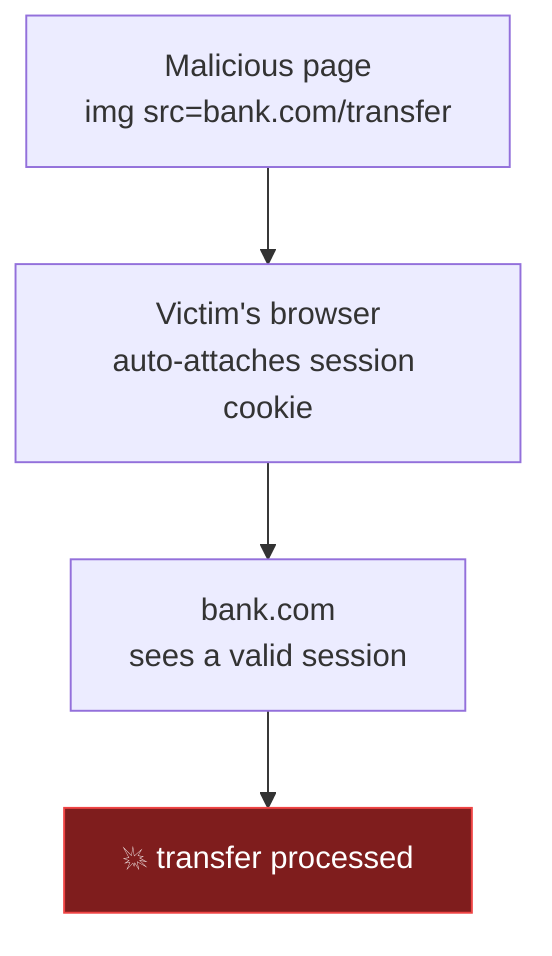
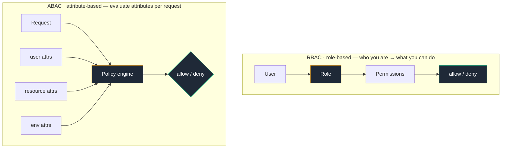

# Lecture 6 — What's Missing: Fill These Gaps

> Structure follows source §5.2–5.3, **6 steps**. Each `##` block maps 1:1 to a unit in
> `src/content/lectures/gaps.ts`. Concept steps are **two-column** (prose left, diagram
> right) with a `section` kicker (e.g. "§ 5.2 · CSRF"); the RBAC explanation is split
> into a full-width prose + a full-width diagram so the model picture renders large.
>
> Covers two topics that don't fit neatly into Lectures 1–5 but come up constantly:
> CSRF, and RBAC vs ABAC. (OIDC / the identity layer was moved up into the OIDC block
> presented with the Sessions & MFA lecture — removed here to avoid duplication.)
>
> **Demos:** trimmed to a single "hero" demo (CSRF Sandbox) for the live 45-minute slot.
> RBACPlayground was removed from the deck.

## Step 1 — 5.2 CSRF: The Browser Sends Cookies for You
**type:** two-column (prose + diagram) · **section:** § 5.2 · CSRF

**Left (prose):** malicious site triggers a credentialed cross-site request (browser auto-sends cookies); bank `` example; fix checklist (`SameSite=Strict`, CSRF tokens, Bearer headers are naturally CSRF-safe); + info callout tying back to Lecture 2's `SameSite=Strict` refresh cookie.

**Right (diagram) — CSRF attack flow:**

---

## Step 2 — CSRF Sandbox (Demo)
**type:** demo · **section:** § 5.2 · CSRF · **demo_key:** CSRFSandbox

Fire a forged cross-site request, then toggle `SameSite=Strict` / a CSRF token to watch it get blocked. *(Only live demo in this lecture.)*

---

## Step 3 — 5.3 RBAC vs ABAC: Modeling Permissions
**type:** prose (full-width) · **section:** § 5.3 · RBAC vs ABAC

RBAC (roles → permissions; simple, roles bloat) vs ABAC (policies over user/resource/env attributes; flexible, harder to debug). Rule of thumb: start with RBAC, move to ABAC when roles can't express the policy — e.g. *"editors can edit only their own posts."*

---

## Step 4 — 5.3 RBAC vs ABAC: Two Ways to Decide
**type:** diagram (full-width) · **section:** § 5.3 · RBAC vs ABAC

Full-width model diagram so it renders large (replaced the cramped two-column version).

---

## Step 5 — Checkpoint
**type:** checkpoint (4 questions)

- **CSRF [Easy]** Explain CSRF in one sentence. Why are `Authorization: Bearer` tokens naturally CSRF-safe?
- **CSRF [Medium]** Refresh token in an HttpOnly cookie — which cookie attribute prevents CSRF, and how? (`SameSite=Strict`)
- **RBAC [Medium]** "Editors can edit only documents they own" — can pure RBAC handle it? Reach for ABAC.
- **RBAC/ABAC [Hard]** Multi-tenant SaaS, per-org roles + subscription tier — RBAC or ABAC, and why? (ABAC territory / RBAC + attributes.)

---

## Sources
**type:** prose

# Sources

- [RFC 5849 — OAuth 1.0a](https://datatracker.ietf.org/doc/html/rfc5849)
- [RFC 6749 — OAuth 2.0](https://datatracker.ietf.org/doc/html/rfc6749)
- [RFC 7519 — JWT](https://datatracker.ietf.org/doc/html/rfc7519)
- [RFC 7636 — PKCE](https://datatracker.ietf.org/doc/html/rfc7636)
- [RFC 8725 — JWT Best Current Practices](https://datatracker.ietf.org/doc/html/rfc8725)
- [OpenID Connect Core 1.0](https://openid.net/specs/openid-connect-core-1_0.html)
- [Refresh Token Rotation — Auth0](https://auth0.com/docs/secure/tokens/refresh-tokens/refresh-token-rotation)
- [OWASP JWT Cheat Sheet](https://cheatsheetseries.owasp.org/cheatsheets/JSON_Web_Token_for_Java_Cheat_Sheet.html)
- [OWASP Session Management Cheat Sheet](https://cheatsheetseries.owasp.org/cheatsheets/Session_Management_Cheat_Sheet.html)
- [NIST SP 800-63B](https://pages.nist.gov/800-63-3/sp800-63b.html)
- [FusionAuth — Revoking JWTs](https://fusionauth.io/articles/tokens/revoking-jwts)
- [passkeys.dev](https://passkeys.dev/)

Related Notion pages:
- [Revolution of AuthN & AuthZ](https://www.notion.so/32a01fb05bf18139b980fc2d4c6369b9)
- [Read More: Auth0 & Keycloak](https://www.notion.so/32a01fb05bf18178b9e3e965a30a5a0e)

---
